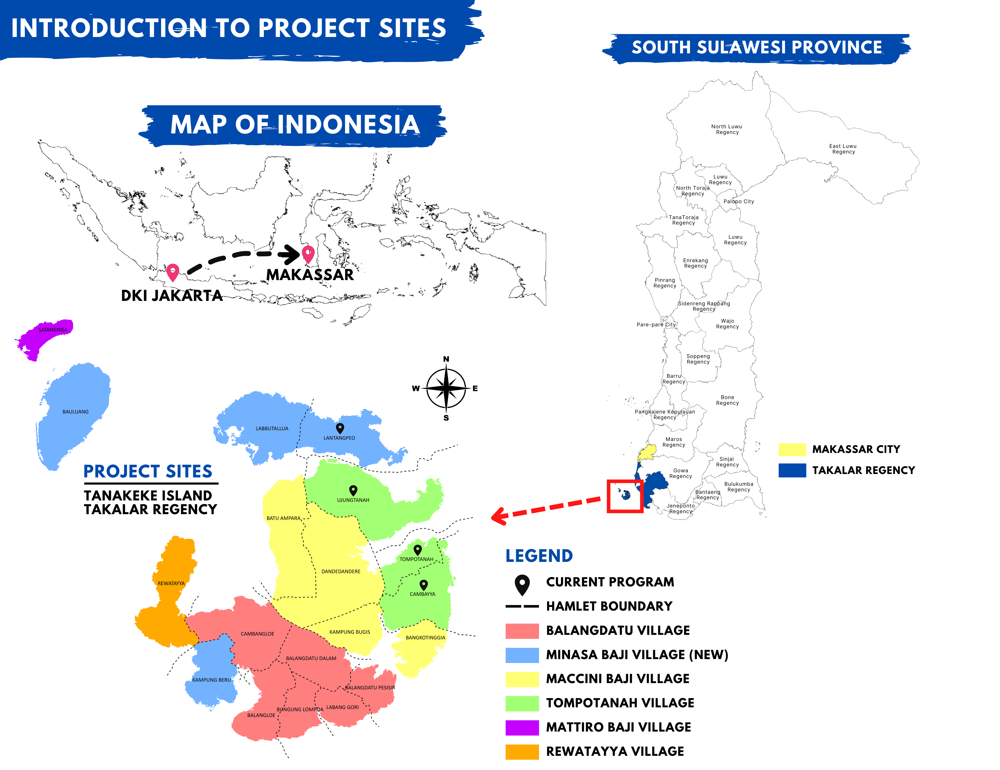

```{r setup, include=FALSE}
knitr::opts_chunk$set(echo = FALSE, warning = FALSE, message = FALSE, dev="cairo_pdf")

library(tidyverse)
library(cowplot)
library(ggplot2)

URUV_data <- read.csv("URUVS/Datasheets/Master_RecordingData.csv")

D6_HOBO <- read.csv("URUVS/Datasheets/HOBO/HOBO02.2024_21370988_3_D6.csv")
L4_HOBO <- read.csv("URUVS/Datasheets/HOBO/HOBO02.2024_21370989_2_L4.csv")
E5_HOBO <- read.csv("URUVS/Datasheets/HOBO/HOBO02.2024_21513093_1_E5.csv")


colnames(D6_HOBO) <- c("unique", "date", "temp", "light")
#D6_HOBO$date <- as.Date(D6_HOBO$date, format = "%m/%d/%Y HH:MM:SS")

colnames(L4_HOBO) <- c("unique", "date", "temp", "light")
#L4_HOBO$date <- as.Date(L4_HOBO$date, format = "%m/%d/%Y HH:MM:SS")

colnames(E5_HOBO) <- c("unique", "date", "temp", "light")
#E5_HOBO$date <- as.Date(L4_HOBO$date, format = "%m/%d/%Y HH:MM:SS")

```

# OBJECTIVES

1. Determine the effect of mangrove restoration on the fishery production on Pulau Tanakeke, Takalar Regency, South Sulawesi Province, Indonesia.

2. Uncover what aspects of mangrove cover is most beneficial to juvenile fish populations (i.e. reductions in water temperature, shade, or increased plant biomass).

3. Disseminate these findings to the local community on Tanakeke with the help of the NGO Blue Forest as part of their community engagement program as well as publish findings to international scientific journals.


# STUDY FIELD DESCRIPTION

Mangroves are inter-tidal forests that are essential components to many tropical ecosystems. As the effects of climate change grow stronger worldwide, the need for carbon mitigation and protection against extreme weather are becoming more urgent. Mangroves biomes comprise about 14 % of marine carbon sequestration and may result in high gas emissions when these ecosystems are disturbed [@alongiCarbonSequestrationMangrove2012], while more established mangroves are more efficient in absorbing atmospheric carbon [@cameronEstimatingFullGreenhouse2019]. Beyond their benefits of protecting against extreme weather events, mangroves are also key actors in maintaining the biodiversity of the ecosystems they inhabit. Mangroves have been reported to support up 20% of the benthic biodiversity in their habitats [@carugatiImpactMangroveForests2018]. They provide essential nutrients, temperature controls, and protection from predators for marine life [@blueforestsAdaptiveCollaborativeManagement2012new]. Further, Mangroves have been shown to increase fishery yields in their surrounding areas, therefore increasing fisher income [@aburto-oropezaMangrovesGulfCalifornia2008]. The root systems of mangroves provide shelter and protection for juvenile fish, allowing them to grow and develop safely away from predators and also also act as a buffer against strong currents and waves, creating calmer and more stable environments where fish can feed and reproduce [@alongiMangroveForestsResilience2008]. Areas with intact mangrove forests have been shown to support higher fish abundance and diversity compared to areas without mangroves [@nagelkerkenHabitatFunctionMangroves2008]. Mangroves provide a rich food web, with leaf litter and detritus serving as a source of nutrients that fuel the basis of the food chain, supporting the growth and survival of various fish species [@alongiMangroveForestsResilience2008]. Furthermore, mangroves act as a buffer against coastal erosion and storm surges, safeguarding the habitats of both fish and fishermen [@nagelkerkenHabitatFunctionMangroves2008]. Mangroves offer a crucial line of defense against the impacts of climate change on fisheries. The dense root systems of mangroves stabilize shorelines and protect coastal areas from erosion caused by rising sea levels and extreme weather events [@alongiMangroveForestsResilience2008]. As the largest archipelago in the world, marine fisheries are an extremely important resource in Indonesia for food security and fisher income. Fisheries contribute to about 3% of the GDP in Indonesia, and over 80% of fishery catches are from small scale fisheries, however these systems are currently subject to over-exploitation, threatening the food security of those who are reliant on these fisheries [@ayundaImpactSmallScaleFisheries2018].

Despite all of their contributions to ecosystem health, mangrove environments are being threatened worldwide. Rising sea-levels has been shown to be a major contributor to mangrove loss [@gilmanThreatsMangrovesClimate2008]. Further, as extreme events are becoming more intense and more frequent, these could potentially threaten mangroves due to defoliation, soil erosion, or by altering the chemical makeup or temperature of soils [@gilmanThreatsMangrovesClimate2008]. Mangroves are also directly threatened by anthropogenic activity. Pollution, coastal development, and aquaculture development have also contributed to mangrove ecosystem loss [@adeelAssessmentManagementMangrove2002]. Mangrove forests in the Western Tropical Pacific are the most diverse of these habitats globally [@ellisonOriginsMangroveEcosystems1999]. Indonesia has the most extensive mangrove forests in the world [@kusmanaManagementMangroveEcosystem2011]. As Indonesia is also the largest archipelagic country, mangroves’ contribution to flood protection and extreme weather mitigation is vital to the health and safety of many of its inhabitants. However, due to timber production, aquaculture, and human development, the Ministry of Forestry reported in 2007 that around 69% of mangroves were in damaged condition in the country [@kusmanaManagementMangroveEcosystem2011]. As a response to this habitat loss, the Indonesian government has committed to restoring 600,000 hectares of mangroves in the country in 2024, the most ambitious mangrove restoration project in the world. Tanakeke Island in South Sulawesi, Takalar Regency, is one location where this restoration effort is taking place. Here, mangrove habitats are generally privately owned, and the main driver of mangrove loss has been timber production and shrimp aquaculture [@blueforestsAdaptiveCollaborativeManagement2012new]. 1,200 hectares of mangroves were converted into aquaculture ponds in the 1980s and 1990s, which is about 70% of its historical cover [@brownCASESTUDYCommunity]. Recently, there have been reports of increased flooding on this island which could be attributed to the loss of protection from mangroves [@blueforestsAdaptiveCollaborativeManagement2012new]. However, in response to mangrove restoration, the community has seen great success in both engagement and successful mangrove rehabilitation, where hundreds of community members have participated since the 1990’s [@blueforestsAdaptiveCollaborativeManagement2012new; @PresentTanakekeIsland2013]. Further, small scale fishing is an essential part of peoples’ livelihoods on Tanakeke. Locally caught seafood is the main source of protein on this island [@blueforestsAdaptiveCollaborativeManagement2012new]. 

Mangroves provide refuge for about 55% fish catch biomass in Indonesia [@theworldbankNewProjectWill2022new]. Fisher income has been shown to be negatively affected by mangrove habitat loss, and because of this, the financial gain of mangrove restoration is predicted to be more lucrative than any alternative land use such as aquaculture [@yamamotoLivingEcosystemDegradation2023]. For this reason, mangroves are an essential component to the health of Indonesia’s fisheries and contribute significantly to the food security of those directly reliant on small scale fisheries as a key source of nutrition, including on Tanakeke Island [@blueforestsAdaptiveCollaborativeManagement2012new]. While these mangrove restoration efforts have resulted in increased flood prevention and ecotourism, little research has been done to assess the improvements in marine biodiversity and benefits to fish stocks.

# OBJECTIVE TO BE INVESTIGATED

In this project, we aim to understand how this restoration is affecting local marine biodiversity and the sustainability of commercially fished species on Tanakeke Island. We will use Unbaited Remote Underwater Video (URUV) methods which are non-invasive and cost effective.<!-- NONINVASIVE --> Methodology in this research will involve only observation and observation with video. No direct contact with animals will occur over the course of this project. <!-- NONINVASIVE --> We will use URUV to assess the marine biodiversity of mangrove habitats and compare them to the biodiversity of areas that have not undergone mangrove rehabilitation. Further, we will collect temperature and light data to create a statistical analysis of which variable is the most important when fostering biodiversity in mangroves. We hypothesize that fully-grown mangroves will contain the highest levels of fish biodiversity as well as abundance, and that destroyed mangroves will result in the lowest levels. We also hypothesize that factors such as light level and temperature all contribute to this higher biodiversity in lush-mangrove areas.

# METHODS

## Site description:
Pulau Tanakeke (Figure \ref{Tanakeke}) is situated about 40 km southwest of Makassar in South Sulawesi, Takalar Regency. The island is a coral atoll covering about 3,930 hectares. About 392.25 hectares of mangrove has been restored [@cameronEstimatingFullGreenhouse2019]. Access to the island presents a challenge as rough seas make sea crossings difficult during rainy seasons. The island comprises of five villages or desa: Balangdatu,  Maccinibaji, Mattirobaji, Rewataya, and Tompotana. Historically, the island was populated with about 1,776 hectares of Mangroves, most of which has been destroyed for aquaculture. URUVs were selected as the methodology of this project because this method is non-invasive and does not require the capture or killing of fish in order to acquire data. Further, they are relatively simple to install in the field and once collected, data can be analyzed once out of the field setting.


(ref:tanakeke) A map of Tanakeke Island with village (desa) names (left). The right image shows the mangrove restoration sites on Tanakeke Island by Blue forests. Both images are courtesy of Blue Forests.

```{r Tanakeke, echo = FALSE, fig.show="hold", out.width="45%", results = "asis", fig.cap = '(ref:tanakeke) \\label{Tanakeke}'}


knitr::include_graphics("Tanakeke_Sites.png")

```

## Equipment:
For the video recording data, we will use six SJCAM SJ4000 Action Camera 4K30fps WiFi Cameras. In order to collect the temperature and light data, we will use a HOBO Pendant Temperature/Light 64K Data Logger.

## Data Collection:
In this project, we plan on selecting three different sites across the island. Within each site, we will locate a recently restored mangrove, mangroves that were restored over ten years ago, and an area where mangroves have not been rehabilitated yet. Recently restored mangrove sites will be in Lantangpeo, where Blue Forests is currently working on mangrove rehabilitation (Figure \ref{Tanakeke}). Sites that have been restored over ten years ago and unrestored sites will be located in Tompotanah and Ujungtanah (Figure \ref{Tanakeke}). At each site, we will place two cameras at 1m depth facing horizontally at a 7 degree angle from one another in order to measure fish length and water visibility. Next to the cameras, we will place the light and temperature loggers which will collect throughout the duration of filming. With two cameras per location, this will total 18 cameras deployments per month for nine months between February 2024 and October 2024.<!-- TIMING --> Cameras will record for 1 hour. After which, the cameras and loggers will be extracted from the site, the recording will be downloaded, and then the cameras will be moved to the next site where we will conduct the same experiment. Sampling of each site will occur on a monthly basis.<!-- NONINVASIVE --> Methodology in this research will involve only observation and observation with video. No direct contact with animals will occur over the course of this project.<!-- NONINVASIVE -->

## Analysis:
We will measure biodiversity using the MaxN calculation method, as it is the most robust calculation for relative abundance [@whitmarshWhatBigBRUVver2017]. Further, we will use the data collected from the temperature and light loggers to create a statistical model of fish abundance in order to determine if fish abundance is more attributed to decreased water temperature or the shaded areas provided by mangrove habitats.
Expected Result
As has been found in previous literature, we expect the sites with older, more established mangroves to foster the most biodiversity of juvenile fishes due to better shelter from predators and cooler temperatures. We expect the areas with no mangrove restoration to exhibit the least amount of biodiversity due to the exposure of these environments to predators and higher temperatures.

# PROVISIONAL RESULTS

We have so far completed two sampling events, one at the end of February 2024 and one at the end of March 2024. Both samplings resulted in a full collection of video data. As videos take at least 18 hours of processing, we have only analyzed the data from February. This data shows that the highest biodiversity has been seen in datapoints where the mangroves are fully grown (Figure \ref{FishSpecies}). Further, as the species are still being identified, the most abundant fish across all three sites has been pipefish. Figure \ref{Pipefish} shows that these are most abundant in lush mangrove sites. As for the data collected from the HOBOs, figure \ref{dailytempaverage} shows that mangrove environments have lower water temperatures. 
These preliminary results support our hypotheses that the highest biodiversity and fish abundance is found in lush mangroves. Further, we show through our HOBO data collection that lush mangroves are also maintaining the lowest water temperatures of all our sites. Subsequent data collection in the following months will serve to further confirm this result. These results show that mangroves do help fisheries in Tanakeke Island, and therefore further securing access to nutrition sources for this community. These results also serve as evidence that the replanting efforts made by blue forests have benefitted the community not only in restoring protections against erosion, $CO_2$ mitigation, both direct benefits of mangroves, but have also cascading benefits of helping their livelihoods as well.

```{r dataClean}

URUV_data$DATE <- as.Date(URUV_data$DATE, format = "%d/%m/%Y")

URUV_data <- URUV_data %>%
  filter(!is.na(F1_TIME)) %>% #Take out unused videos
  rowwise() %>%
  mutate(WATER_DEPTH_AVERAGE = mean(c(WATER_DEPTH_BEFORE, WATER_DEPTH_AFTER), na.rm=TRUE)) #Take avg depth during recording

#View(URUV_data)

```

```{r FishSpecies, results = 'asis', echo = FALSE, fig.show = "hold", out.width = "50%", fig.cap = "Biodiversity of fish species from February URUV Data collection"}

ggplot(URUV_data, aes(x=DESA, y=NO_FISHSPECIES)) + 
  geom_boxplot() +
  geom_jitter(shape=16, position=position_jitter(0.2))

ggplot(URUV_data, aes(x=SITE_TYPE, y=NO_FISHSPECIES)) + 
  geom_boxplot() +
  geom_jitter(shape=16, position=position_jitter(0.2))

```

```{r Pipefish, fig.cap = "MaxN of pipefish across all of the three mangrove types Lush (L), Degraded (D), and newly restored (E)"}

#Graph boxplot per site type
ggplot(URUV_data, aes(x=SITE_TYPE, y=MAXN_PIPEFISH)) +
    geom_boxplot() +
    geom_jitter(shape=16, position=position_jitter(0.2))

```

```{r dailytempaverage, fig.cap = "Daily average water temperature of lush (green), newly restored (blue), and destroyed (red) mangroves"}

D6_avg <- tidyr::separate(D6_HOBO, 'date',
                                    into = c('longdate', 'time'),
                                    sep= ' ') %>%
  tidyr::separate('longdate',
                  into = c('month', 'day', 'year'),
                  sep= '/',
                  remove = FALSE) %>% 
  select(-matches('^$')) %>%
  group_by(year, month, day, longdate) %>%
  summarise(meantemp = mean(temp),
            meanlight = mean(light))

D6_avg$month <- factor(D6_avg$month, levels=c("02", "03", "04", "05", "06", "07", "08", "09", "10", "11", "12", "01"))

L4_avg <- tidyr::separate(L4_HOBO, 'date',
                                    into = c('longdate', 'time'),
                                    sep= ' ') %>%
  tidyr::separate('longdate',
                  into = c('month', 'day', 'year'),
                  sep= '/',
                  remove = FALSE) %>% 
  select(-matches('^$')) %>%
  group_by(year, month, day, longdate) %>%
  summarise(meantemp = mean(temp),
            meanlight = mean(light))

L4_avg$month <- factor(L4_avg$month, levels=c("02", "03", "04", "05", "06", "07", "08", "09", "10", "11", "12", "01"))

E5_avg <- tidyr::separate(E5_HOBO, 'date',
                                    into = c('longdate', 'time'),
                                    sep= ' ') %>%
  tidyr::separate('longdate',
                  into = c('month', 'day', 'year'),
                  sep= '/',
                  remove = FALSE) %>% 
  select(-matches('^$')) %>%
  group_by(year, month, day, longdate) %>%
  summarise(meantemp = mean(temp),
            meanlight = mean(light))

E5_avg$month <- factor(E5_avg$month, levels=c("2", "3", "4", "5", "6", "7", "8", "9", "10", "11", "12", "1"))

ggplot() +
  geom_smooth(data = D6_avg, aes(x=as.Date(longdate, format= "%m / %d / %Y"), y=meantemp), colour="red") +
  geom_smooth(data = L4_avg, aes(x=as.Date(longdate, format= "%m / %d / %Y"), y=meantemp), colour="green") +
  geom_smooth(data = E5_avg, aes(x=as.Date(longdate, format= "%m / %d / %Y"), y=meantemp), colour="blue") +
    theme_bw()+
    labs(title= "Daily temperature means", y="Daily mean temperature (°C) with 95% CI", x="Date")

```

# PROBLEMS ENCOUNTERED

Salt water has gotten into some of our equipment requiring a replacement, which has resulted in being slightly over budget.

# PLANNED ACTIVITY FOR THE NEXT THREE MONTHS

We will continue to collect data monthly on Tanakeke with the same methods described above.

\newpage

# Works Cited