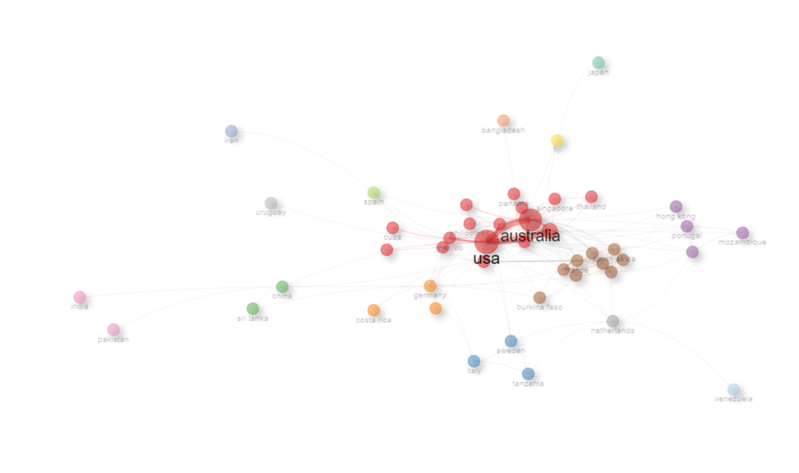

---
output:
  bookdown::pdf_document2:
    fig_caption: yes
    toc: no
    lof: yes
    lot: yes
    keep_tex: yes
  pdf_document:
    toc: no
  bookdown::html_document2:
    fig_caption: yes
    toc: no
  word_document: default
geometry: margin=1in
fontsize: 12pt
bibliography:
- BIBA.bib
- BIBA2.bib
csl: apa_1.csl
header-includes: \usepackage{setspace} \usepackage{lineno} \usepackage{placeins} \usepackage[nottoc,notlof,notlot]{tocbibind} \renewcommand{\contentsname}{} \renewcommand{\listfigurename}{} \renewcommand{\listtablename}{} \usepackage{sectsty} \sectionfont{\centering}
---

\doublespacing

\begin{center}
	
\textbf{\Large Bibliometric Analysis of Mangroves in Fisheries}
	
\textsc{Sophie Wulfing$^{1*}$ and Rohani Ambo Rappe$^{1}$\\}
\vspace{3 mm}
\normalsize{\indent $^1$Department of Marine Ecology, Hasanuddin University, Indonesia\\}
$\text{*}$ Corresponding authors: Sophie Wulfing (SophieWulfing@gmail.com)
\end{center}

\newpage

```{r setup, include=FALSE}
knitr::opts_chunk$set(echo = FALSE,warning = FALSE, message = FALSE)

library(bibliometrix) #load the package
library(pander) #other required packages
library(knitr)
library(kableExtra)
library(ggplot2)
library(bibliometrixData)
library(dplyr)
library(biblionetwork)
library(maps)
library(RColorBrewer)
library(countrycode)
library(ggthemes)
# use scopuscollection data from the package 

mangroveData <- read.csv('mangroveANDfisheriesANDbiomassORbiodiversity.csv')
rhiz_bb <- read.csv('rhizophoraANDbiomassORbiodiversity.csv')
rhiz_f <- read.csv('rhizophoraANDfisheries.csv')
rhiz_all <- read.csv('rhizophoraANDfisheriesANDbiomassORbiodiversity.csv')

```

```{r packageDownload}

package_list <- c(
  "here", # use for paths creation
  "tidyverse",
  "bib2df", # for cleaning .bib data
  "janitor", # useful functions for cleaning imported data
  "rscopus", # using Scopus API
  "biblionetwork", # creating edges
  "tidygraph", # for creating networks
  "ggraph" # plotting networks
)
for (p in package_list) {
  if (p %in% installed.packages() == FALSE) {
    install.packages(p, dependencies = TRUE)
  }
  library(p, character.only = TRUE)
}

github_list <- c(
  "agoutsmedt/networkflow", # manipulating network
  "ParkerICI/vite" # needed for the spatialisation of the network
)
for (p in github_list) {
  if (gsub(".*/", "", p) %in% installed.packages() == FALSE) {
    devtools::install_github(p)
  }
  library(gsub(".*/", "", p), character.only = TRUE)
}


```

```{r DataCleaning, include = FALSE}

# Package names:
# mangroveData
# rhiz_bb 
# rhiz_f
# rhiz_all

#NEED ACCESS KEY TO TABLEAU

```

```{r analysis, eval = FALSE}
biblioshiny()

```

# INTRODUCTION

Mangroves are inter-tidal forests that are essential components to many tropical ecosystems. As the effects of climate change grow stronger worldwide, the need for carbon mitigation and protection against extreme weather are becoming more urgent. Mangroves biomes comprise about 14 % of marine carbon sequestration and may result in high gas emissions when these ecosystems are disturbed [@alongiCarbonSequestrationMangrove2012], while more established mangroves are more efficient in absorbing atmospheric carbon [@cameronEstimatingFullGreenhouse2019]. Beyond their benefits of protecting against extreme weather events, mangroves are also key actors in maintaining the biodiversity of the ecosystems they inhabit. Mangroves have been reported to support up 20% of the benthic biodiversity in their habitats [@carugatiImpactMangroveForests2018]. They provide essential nutrients, temperature controls, and protection from predators for marine life [@blueforestsAdaptiveCollaborativeManagement2012new]. Further, Mangroves have been shown to increase fishery yields in their surrounding areas, therefore increasing fisher income [@aburto-oropezaMangrovesGulfCalifornia2008]. The root systems of mangroves provide shelter and protection for juvenile fish, allowing them to grow and develop safely away from predators and also also act as a buffer against strong currents and waves, creating calmer and more stable environments where fish can feed and reproduce [@alongiMangroveForestsResilience2008]. Areas with intact mangrove forests have been shown to support higher fish abundance and diversity compared to areas without mangroves [@nagelkerkenHabitatFunctionMangroves2008]. Mangroves provide a rich food web, with leaf litter and detritus serving as a source of nutrients that fuel the basis of the food chain, supporting the growth and survival of various fish species [@alongiMangroveForestsResilience2008]. Furthermore, mangroves act as a buffer against coastal erosion and storm surges, safeguarding the habitats of both fish and fishermen [@nagelkerkenHabitatFunctionMangroves2008]. Mangroves offer a crucial line of defense against the impacts of climate change on fisheries. The dense root systems of mangroves stabilize shorelines and protect coastal areas from erosion caused by rising sea levels and extreme weather events [@alongiMangroveForestsResilience2008].

Despite all of their contributions to ecosystem health, mangrove environments are being threatened worldwide. Rising sea-levels has been shown to be a major contributor to mangrove loss [@gilmanThreatsMangrovesClimate2008]. Further, as extreme events are becoming more intense and more frequent, these could potentially threaten mangroves due to defoliation, soil erosion, or by altering the chemical makeup or temperature of soils [@gilmanThreatsMangrovesClimate2008]. Mangroves are also directly threatened by anthropogenic activity. Pollution, coastal development, and aquaculture development have also contributed to mangrove ecosystem loss [@adeelAssessmentManagementMangrove2002]. Mangrove forests in the Western Tropical Pacific are the most diverse of these habitats globally [@ellisonOriginsMangroveEcosystems1999].

DISCUSSITON OF SSF AND CONNECTION TO MANGROVES AND THEN GO INTO WHY YOU'RE WRITING THIS
210 million people worldwide live within 10 km mangroves (TNC Stats CHECK)

Tables 1-5 attempt to estimate financial contribution of mangroves worldwide. Huge range means difficult to measure because high data requirement and this depends on mangrove area and size. However, specific examples have been found in small-scale fisheries worldwide, where the estimates have been as high as 12,305 USD/Ha/Yr

Biggest single driver of mangrove loss has been for conversion to aquaculture ponds or urban expansion, however these only see short-term economic gains, or gains that are only seen by a small number of people in the community
hutchisonRoleMangrovesFisheries2014

We estimate there are 4.1 million mangrove associated fishers globally, with the highest number of mangrove fishers found in Indonesia, India, Bangladesh, Myanmar, and Brazil. zuermgassenReprintFishersWho2021

Some of the countries with highest numbers of mangrove reliant fishers also have the highest dependence on fisheries for essential sources of nutrition zuermgassenReprintFishersWho2021


Bibliometric analysis is a statistical analysis of trends in research related to a specific topic. SOME MORE EXPLANATION OF BIB ANALYSIS


# METHODS


# RESULTS AND DISCUSSION

When searching research articles that cover mangroves, fisheries, and biomass or biodiversity in the SCOPUS database, a total of NUMBEROFDOCS were found from a 138 different sources. Dates of publication ranged form 1989 to 2024, and 37.45% of these articles were written with international co-Authorship. Figure \ref{AnnualScientificProduction} shows the total number of articles published which use the keywords of mangroves, fisheries and biomass or biodiversity. The greatest increase of number of papers written that covers these three topics was in 2015, when the number of articles was 7 to 2016, where the number of articles doubled to 14. The highest number of articles in this analysis was seen in 2022 with 29 articles. The journal that has published the most papers in these areas was Ocean and Coastal Management with 13 total publications. However, this journal's first paper relevant to mangroves, fisheries, and biomass or biodiversity was first published in 2005, whereas Estuarine, Coastal, and Shelf Science, the second most active journal, published it's first paper on the subject in 1989 \ref{SourceDynamics}.

and Seas at the Millennium. SOME INFORMATION ABOUT EACH JOURNAL.

However, Seas at the Millennium was #3 a WHY DID THIS JUST HAVE ONE UPTIC. 

BIODIVERSITAS COMES IN 4TH BEHIND MARINE POLLUTION BULLETIN. iS THIS THE FIRST NON-ENGLISH LANGUAGE JOURNAL?

In terms of geographic distribution of research on mangroves, fisheries, and biomass or biodiversity, Australia has the highest number of total authorship as well as the highest number of secondary authorship whereas the country with the most Main Corresponding authors is the United States. The United States also has the highest number of cited documents, with 3,625 total citations (Figure \ref{AuthorCountries}). MAKE MAP OUT OF COUNTRY_PRODUCTION DOCUMENT WITH COUNTRY TITLES.

Keyword trends are helpful indicators of WHAT IS RELEVANT IN SCIENCE IDK LOL. Figure \ref{TrendTopics}shows the most relevant keywords (used more than ten times total and over three times a year) and which years they have been the most used. Most recently, the terms carbon, human, and climate change have become the most relevant topics. This is likely due to SAY SOME MANGROVE FAKTS LIKE THEIR DESTRUCTION UNDER HUMNA INFLUENCE AND THEIR HELP AGAINST CLIMATE CHANGE. MAYBE SOMETHING ABOUT THE INDIAN OCEAN, IDK

## Collaborations

Figure \ref{CountryCollaborationNetwork} shows the amount of authorship collaboration that occurs between each country. By far, the greatest amount of authorship collaboration that occurs is between the US and Australia. SOME DISCUSSION ABOUT GEOGRAPHICAL DISTRIBUTION OF MANGROVES

```{r AnnualScientificProduction, echo = FALSE, results = "asis", fig.cap = '(ref:annualscientificproduction) \\label{AnnualScientificProduction}', out.width = "100%"}

knitr::include_graphics("AnnualScientificProduction.png")

```

(ref:annualscientificproduction) Fig Cap

```{r SourceDynamics, results = 'asis', echo = FALSE, fig.show = "hold", out.width = "50%", fig.cap = '(ref:sourcedynamics) \\label{SourceDynamics}'}

knitr::include_graphics("MostRelevantSources.png")
knitr::include_graphics("SourceDynamics.png")

```
(ref:sourcedynamics) Fig Cap

```{r AuthorCountries, echo = FALSE, results = "asis", fig.cap = '(ref:authorcountries) \\label{AuthorCountries}', out.width = "100%"}

knitr::include_graphics("AuthorCountries.png")

```

(ref:authorcountries) Fig Cap

```{r MostCitedCountries, echo = FALSE, results = "asis", fig.cap = '(ref:mostcitedcountries) \\label{MostCitedCountries}', out.width = "100%"}

knitr::include_graphics("MostCitedCountries.png")

```

(ref:mostcitedcountries) Fig Cap

```{r countryMap, eval = FALSE}

CountryProduction <- read.csv("Country_Production.csv")
CountryProduction$region <- str_to_title(CountryProduction$region)
CountryProduction$region[CountryProduction$region == "Usa"] <- "USA"
CountryProduction$region[CountryProduction$region == "Uk"] <- "UK"

world_map = map_data("world")

countries = world_map %>%
  distinct(region)

CP <- left_join(countries, CountryProduction, by = "region")

CP %>% 
  ggplot(aes(fill = Freq, map_id = region)) +
  scale_fill_continuous(trans = 'reverse', name = "Publications") +
  geom_map(map = world_map) +
  borders(database = "world", colour = "black", size = .1) +
  expand_limits(x = world_map$long, y = world_map$lat) +
  theme_map()

```

```{r mangroveMap, eval = FALSE}

#Data from: https://onlinelibrary.wiley.com/doi/10.1111/geb.12449
#Data limited to countries with over 1000 sq km of mangroves

mangroves <- read.csv("MangroveCover.csv")
colnames(mangroves) <- c("region", "KM", "Percent")
mangroves$KM <- as.numeric(gsub(",","",mangroves$KM))

world_map = map_data("world")

countries = world_map %>%
  distinct(region)

MP <- left_join(countries, mangroves, by = "region")

MP %>% 
  ggplot(aes(fill = KM, map_id = region)) +
  scale_fill_gradient2(low = "#fffee5", mid = "#d9f0a3",high = "#004429", name = "MangroveCover (KM)") +
  geom_map(map = world_map) +
  borders(database = "world", colour = "black", size = .1) +
  expand_limits(x = world_map$long, y = world_map$lat) +
  theme_map()

```

```{r TrendTopics, echo = FALSE, results = "asis", fig.cap = '(ref:trendtopics) \\label{TrendTopics}', out.width = "100%"}

knitr::include_graphics("TrendTopics.png")

```

(ref:trendtopics) Fig Cap

```{r CountryCollaborationNetwork, echo = FALSE, results = "asis", fig.cap = '(ref:countrycollaborationnetwork) \\label{CountryCollaborationNetwork}', out.width = "100%"}



```

(ref:countrycollaborationnetwork) Fig Cap