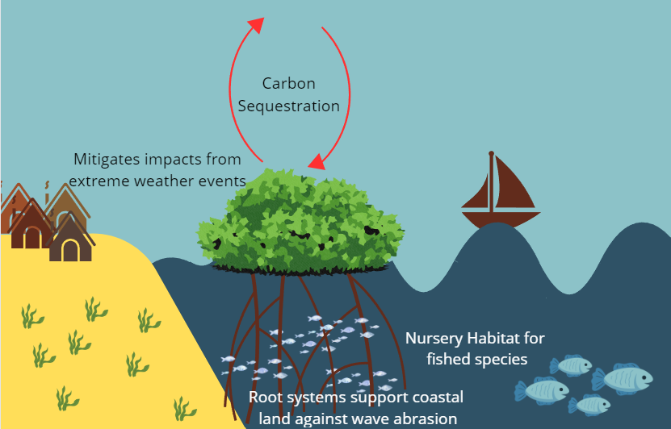
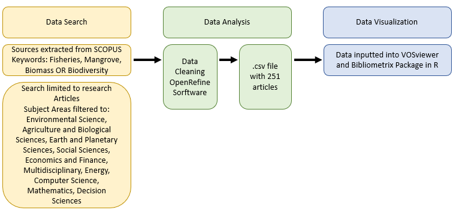
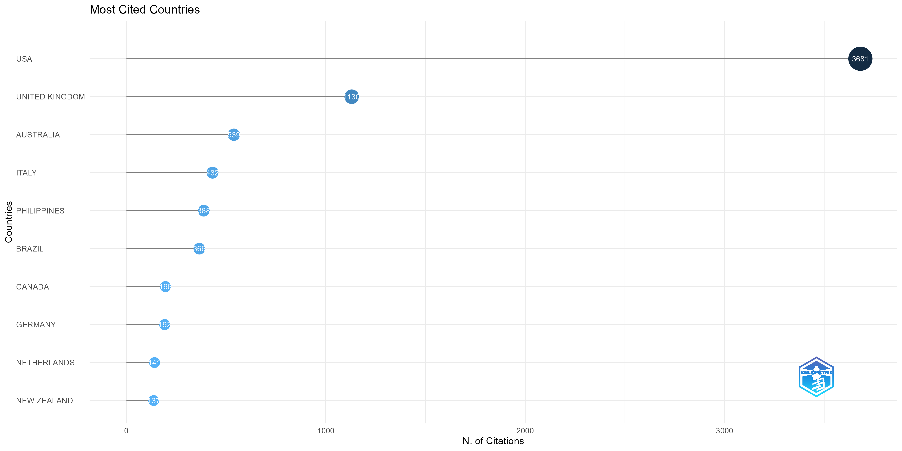
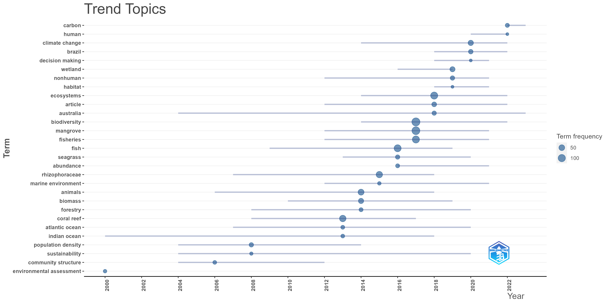

---
output:
  bookdown::pdf_document2:
    fig_caption: yes
    toc: no
    lof: yes
    lot: yes
    keep_tex: yes
  pdf_document:
    toc: no
  bookdown::html_document2:
    fig_caption: yes
    toc: no
  word_document: default
geometry: margin=1in
fontsize: 12pt
bibliography:
- BIBA.bib
- BIBA2.bib
csl: apa_1.csl
header-includes: \usepackage{setspace} \usepackage{lineno} \usepackage{placeins} \usepackage[nottoc,notlof,notlot]{tocbibind} \renewcommand{\contentsname}{} \renewcommand{\listfigurename}{} \renewcommand{\listtablename}{} \usepackage{sectsty} \sectionfont{\centering}
---

\doublespacing

\begin{center}
	
\textbf{\Large Bibliometric Analysis of Mangroves in Fisheries}
	
\textsc{Sophie Wulfing$^{1*}$ and Rohani Ambo Rappe$^{1}$\\}
\vspace{3 mm}
\normalsize{\indent $^1$Department of Marine Ecology, Hasanuddin University, Indonesia\\}
$\text{*}$ Corresponding authors: Sophie Wulfing (SophieWulfing@gmail.com)
\end{center}

\newpage

```{r setup, include=FALSE}
knitr::opts_chunk$set(echo = FALSE,warning = FALSE, message = FALSE)

library(stringr)
library(bibliometrix) #load the package
library(pander) #other required packages
library(knitr)
library(kableExtra)
library(ggplot2)
library(bibliometrixData)
library(dplyr)
library(biblionetwork)
library(maps)
library(RColorBrewer)
library(countrycode)
library(ggthemes)

# use scopuscollection data from the package 

mangroveData <- read.csv('mangroveANDfisheriesANDbiomassORbiodiversity.csv')
rhiz_bb <- read.csv('rhizophoraANDbiomassORbiodiversity.csv')
rhiz_f <- read.csv('rhizophoraANDfisheries.csv')
rhiz_all <- read.csv('rhizophoraANDfisheriesANDbiomassORbiodiversity.csv')

```

```{r packageDownload}

package_list <- c(
  "here", # use for paths creation
  "tidyverse",
  "bib2df", # for cleaning .bib data
  "janitor", # useful functions for cleaning imported data
  "rscopus", # using Scopus API
  "biblionetwork", # creating edges
  "tidygraph", # for creating networks
  "ggraph" # plotting networks
)
for (p in package_list) {
  if (p %in% installed.packages() == FALSE) {
    install.packages(p, dependencies = TRUE)
  }
  library(p, character.only = TRUE)
}

github_list <- c(
  "agoutsmedt/networkflow", # manipulating network
  "ParkerICI/vite" # needed for the spatialisation of the network
)
for (p in github_list) {
  if (gsub(".*/", "", p) %in% installed.packages() == FALSE) {
    devtools::install_github(p)
  }
  library(gsub(".*/", "", p), character.only = TRUE)
}


```

```{r DataCleaning, include = FALSE}

# Package names:
# mangroveData
# rhiz_bb 
# rhiz_f
# rhiz_all

#NEED ACCESS KEY TO TABLEAU

```

```{r analysis, eval = FALSE}
biblioshiny()

```

# ABSTRACT

Mangroves are increasingly being recognized as essential biomes for mitigating effects of climate change and maintaining biodiversity. Mangroves also play key roles in many coastal fisheries, as they act as nursery zones form many fished species. As food security and coastal community health become increasingly pressing issues, it is essential to understand where research in these areas are occurring and what are the trending topics related to research on fisheries in mangrove environments. We conduct a bibliometric analysis of research that combines the disciplines of fisheries and mangroves, particularly through the lens of biomass and biodiversity. We find that the number of articles in these topics have been steadily increasing since the 1980's, and there has been increased focus on human impacts and climate change. Further, the majority of research in these areas has been conducted in English speaking countries, or has been published in the English language. Our findings demonstrate that, as the effects of climate change are becoming more severe, protecting these habitats and food sources is also growing in importance. The result that most research is presented in English may also present an accessibility issue, as the majority of mangrove-dependent fisheries being located in countries where English is not the primary language. This study provides insights into why the study of mangrove-dependent fisheries is so important and researchers can potentially address accessibility gaps and facilitate the dissemination of knowledge in this area.

# INTRODUCTION

Mangroves are inter-tidal forests that are essential components to many tropical ecosystems. Mangroves are an essential component of carbon sequestration world-wide [@alongiCarbonSequestrationMangrove2012; @cameronEstimatingFullGreenhouse2019] and help mitigate extreme weather effects, as they absorb the impacts of high winds. Their root systems also hold land against abrasion from waves, therefore reducing coastal erosion in these areas [@zhangRoleMangrovesAttenuating2012; @rahdarianNumericalModelingStorm2017]. Mangroves are key actors in maintaining the biodiversity of the ecosystems they inhabit. Mangroves have been reported to support up 20% of the benthic biodiversity in their habitats [@carugatiImpactMangroveForests2018]. They provide essential nutrients, temperature controls, and protection from predators for marine life [@blueforestsAdaptiveCollaborativeManagement2012new]. Further, Mangroves have been shown to increase fishery yields in their surrounding areas, therefore increasing fisher income [@aburto-oropezaMangrovesGulfCalifornia2008]. The root systems of mangroves provide shelter and protection for juvenile fish, allowing them to grow and develop safely away from predators and also act as a buffer against strong currents and waves, creating calmer and more stable environments where fish can feed and reproduce [@alongiMangroveForestsResilience2008]. Areas with intact mangrove forests have been shown to support higher fish abundance and diversity compared to areas without mangroves [@nagelkerkenHabitatFunctionMangroves2008]. Mangroves provide a rich food web, with leaf litter and detritus serving as a source of nutrients that fuel the basis of the food chain, supporting the growth and survival of various fish species [@alongiMangroveForestsResilience2008]. Furthermore, both fish and fisher communities benefit from mangrove's ability to buffer the effects of storm surges and erosion [@nagelkerkenHabitatFunctionMangroves2008]. Mangroves offer a crucial line of defense against the impacts of climate change and other anthropogenic effects on fisheries (Figure \ref{IntroFig}). Mangrove forests in the Western Tropical Pacific are the most diverse of these habitats globally [@ellisonOriginsMangroveEcosystems1999].

Despite all of their contributions to ecosystem health, mangrove environments are being threatened worldwide. Rising sea-levels has been shown to be a major contributor to mangrove loss [@gilmanThreatsMangrovesClimate2008]. Further, as extreme events are becoming more intense and more frequent, these could potentially threaten mangroves due to defoliation, soil erosion, or by altering the chemical makeup or temperature of soils [@gilmanThreatsMangrovesClimate2008]. Mangroves are also directly threatened by anthropogenic activity. Pollution, coastal development, and aquaculture development have also contributed to mangrove ecosystem loss [@adeelAssessmentManagementMangrove2002].

Anthropogenic activity provides a threat to mangroves as 210 million people worldwide live within 10 km mangroves. The largest single-driver of mangrove loss has been urban expansion or the development of aquaculture ponds. However, economic gains from these activities have been shown to be temporary or only benefiting small portions of the community [@hutchisonRoleMangrovesFisheries2014]. Therefore, the destruction of mangroves often leads to long term financial loss. Although the exact financial gain from fisheries dependent on mangroves is hard to measure world-wide, estimates of the financial contribution of mangroves to small scale fisheries has been shown to be as high as $12,305 per hectare per year. [@hutchisonRoleMangrovesFisheries2014]. An estimated 4.1 million of fishers rely on mangrove-dependent fisheries, primarily in Indonesia, Bangladesh, Myanmar, and Brazil [@zuermgassenReprintFishersWho2021]. Some of the countries with highest numbers of mangrove reliant fishers also have the highest dependence on these fisheries for essential sources of nutrition [@zuermgassenReprintFishersWho2021]. Therefore, not only do mangroves provide essential climate change mitigation and protection against extreme weather, but are the base of of the food web for many essential fisheries around the globe and are a key actor in ensuring food security for many tropical communities.

In order to understand the current status of research in mangrove-dependent fisheries, we conduct a bibliometric analysis of research relating to mangroves, fisheries, and biomass or biodiversity. Bibliometric analysis is a statistical analysis of trends in research related to a specific topic. It can identify the evolution of a scientific topic, as well as emerging questions and interests in the field. It can also be used to locate gaps in scientific knowledge in order to direct where future research should focus [@donthuHowConductBibliometric2021]. Bibliometric analysis is a useful tool to glean out high-impact research as well, and provide a baseline for which papers are highly cited and influential in a field of study [@ellegaardBibliometricAnalysisScholarly2015].

In this study, we aim to conduct a bibliometric analysis of research trends that connect mangroves to fisheries, particularly through the lens of biomass and biodiversity. Our goal of this research is to 1) identify which countries and journals have had the highest impact in this field of study 2) identify trends in keywords in order to identify what issues have driven the research of mangrove-dependent fisheries and 3) to assess the amount of cooperation and collaboration that is occurring in this field in order to understand existing trends in where studies have taken place and identify possible future directions for this field of research.

(ref:introfig) Mangrove benefits to both local environment and coastal communities.

``` {r IntroFig, fig.cap = '(ref:introfig) \\label{IntroFig}'}



```

# METHODS

Documents were collected using the Scopus database. The keywords “Mangroves”, “Fisheries”, and “Biomass OR Biodiversity” were used to conduct the search, and results were filtered to the following subject areas: Environmental Science, Agriculture and Biological Sciences, Earth and Planetary Sciences, Social Sciences, Economics Econometrics and Finance, Multidisciplinary, Energy, Computer Science, Mathematics, and Decision Sciences. A total of 251 articles were found from a total of 138 different sources, and results were limited to research articles so to focus on current research being conducted in this field. Information on year, journal, authors and author country of origin, citations and number of times the paper was cited was collected on each paper to conduct bibliometric analysis. 

## ANALYSIS

The search results were cleaned using OpenRefine website to avoid duplicate keywords with the same meanings. VOSviewer was used to visualize the network of country co-authorship. Further the R package Bibliometrix [@bibmtx] was used to analyze annual scientific production of this topic, which journals and countries have published the most on this topic, and the trending topics covered in papers relating to mangroves, fisheries, and biomass or biodiversity (Figure \ref{MethodsFig}).

(ref:methodsfig) Bibliometric analysis method of data extraction, cleaning, and visualization.

``` {r MethodsFig, fig.cap = '(ref:methodsfig) \\label{MethodsFig}'}



```

# RESULTS

```{r AnnualScientificProduction, echo = FALSE, results = "asis", fig.cap = '(ref:annualscientificproduction) \\label{AnnualScientificProduction}', out.width = "100%"}

knitr::include_graphics("AnnualScientificProduction.png")

```

(ref:annualscientificproduction) Total number of research articles per year that relate to fisheries, mangroves, biomass and biodiversity.

```{r SourceDynamics, results = 'asis', echo = FALSE, fig.show = "hold", out.width = "50%", fig.cap = '(ref:sourcedynamics) \\label{SourceDynamics}'}

knitr::include_graphics("MostRelevantSources.png")
knitr::include_graphics("SourceDynamics.png")

```
(ref:sourcedynamics) Total number of publications relating to mangroves, fisheries, and biomass and biodiversity from the top 10 journals (left). Publication trends from the top 6 journals over time (right)

Dates of publication ranged from 1989 to 2024, and 36.65% of these articles were written with international co-Authorship. Figure \ref{AnnualScientificProduction} shows the total number of articles published which use the keywords of mangroves, fisheries and biomass or biodiversity, showing an average annual growth rate of 5.25%. The greatest increase in the number of papers written that covers these three topics was in 2015, when the number of articles was 7 to 2016, where the number of articles doubled to 14. The highest number of articles in this analysis was seen in 2022 with 29 articles. This indicates that mangrove and fishery research is increasing in relevance and greater focus on the benefits of mangrove on fisheries worldwide.

The journal that has published the most papers in these areas was Ocean and Coastal Management with 13 total publications. However, this journal's first paper relevant to mangroves, fisheries, and biomass or biodiversity was first published in 2005, whereas Estuarine, Coastal, and Shelf Science, the second most active journal, published its first paper on the subject in 1989. The journal of Ocean and Coastal Management publishes papers that focus on governance and management issues while the Estuarine, Coastal, and Shelf Science journal covers a broader, more general focus on ocean and estuary science. However, Seas at the Millennium, the journal with the third most papers, was a one-time journal published at the turn of the century that provided a comprehensive review of the environmental condition of the seas of the world. The top six journals that have published on mangroves, fisheries, and biomass or biodiversity all require publications to be made in English.

```{r AuthorCountries, echo = FALSE, results = "asis", fig.cap = '(ref:authorcountries) \\label{AuthorCountries}', out.width = "100%"}

knitr::include_graphics("AuthorCountries.png")

```

(ref:authorcountries) Authors' country of origin of documents written from both single country publications (SCP) and multiple country publications (MCP).

```{r countryMap, results = 'asis', echo = FALSE, fig.show = "hold", out.width = "50%", fig.cap = '(ref:countrymap) \\label{countryMap}'}

CountryProduction <- read.csv("Country_Production.csv")
CountryProduction$region <- str_to_title(CountryProduction$region)
CountryProduction$region[CountryProduction$region == "Usa"] <- "USA"
CountryProduction$region[CountryProduction$region == "Uk"] <- "UK"

world_map = map_data("world")

countries = world_map %>%
  distinct(region)

#write.csv(countries, "rCountryList")

CP <- left_join(countries, CountryProduction, by = "region")

CP %>% 
  ggplot(aes(fill = Freq, map_id = region)) +
  scale_fill_continuous(trans = 'reverse', name = "Publications") +
  geom_map(map = world_map) +
  borders(database = "world", colour = "black", size = .1) +
  expand_limits(x = world_map$long, y = world_map$lat) +
  theme_map()


#Data from: https://www.sciencedirect.com/science/article/abs/pii/S2095927323003110

mangroves <- read.csv("MangroveCover_2020.csv")
colnames(mangroves) <- c("area", "region", "KM")
mangroves$KM <- as.numeric(gsub(",","",mangroves$KM))

world_map = map_data("world")

countries = world_map %>%
  distinct(region)

MP <- left_join(countries, mangroves, by = "region")

MP %>% 
  ggplot(aes(fill = KM, map_id = region)) +
  scale_fill_gradient2(low = "#fffee5", mid = "#d9f0a3",high = "#004429", name = "MangroveCover (KM)") +
  geom_map(map = world_map) +
  borders(database = "world", colour = "black", size = .1) +
  expand_limits(x = world_map$long, y = world_map$lat) +
  theme_map()


# mangroveCountryCombine <- left_join(MP, CP, by = "region")
# mangroveCountryCombine[is.na(mangroveCountryCombine)] = 0
# #mangroveCountryCombine <- subset(mangroveCountryCombine, select = -c(area) )
# 
# mangroveCountryCombine %>%
#   ggplot(aes(KM,Freq, color=area)) +
#   geom_point(alpha=0.5, size=2) +
#   labs(y="No. publications", x="KM2 mangroves")

```

(ref:countrymap) Number of publications relating to fisheries, mangroves, and biomass or biodiversity (left). Countries with mangrove environments (right)


(ref:mostcitedcountries) Top ten most cited countries on articles relating to mangroves, fisheries, biomass and biodiversity

```{r MostCitedCountries, echo = FALSE, results = "asis", fig.cap = '(ref:mostcitedcountries) \\label{MostCitedCountries}', out.width = "100%"}



```

(ref:countryovertime) Trends of country production in research relating to mangroves, fisheries, and biomass or biodiversity.

```{r CountryOverTime, echo = FALSE, results = "asis", fig.cap = '(ref:countryovertime) \\label{CountryOverTime}', out.width = "100%"}


```

In terms of geographic distribution of research on mangroves, fisheries, and biomass or biodiversity, Australia has the highest number of total authorship as well as the highest number of single-country authorship whereas the country with the most Multi-country authorship is the United States. The United States also has the highest number of cited documents, with 3,681 total citations (Figure \ref{AuthorCountries}). Figure \ref{countryMap} shows the difference between the countries with the most publications relating to mangroves, fisheries, and biomass or biodiversity and compared to the amount of mangrove cover each country has [@jiaMappingGlobalDistribution2023.] The United States is the most cited country in this area (Figure \ref{MostCitedCountries}), with over three times the number of citations as the United Kingdom, country with the second highest number of citations.

```{r CountryCollaborationNetwork, echo = FALSE, results = "asis", fig.cap = '(ref:countrycollaborationnetwork) \\label{CountryCollaborationNetwork}', out.width = "100%"}


```

(ref:countrycollaborationnetwork) Network of each country's collaboration with eachother, larger nodes mean a higher number of publications while thicker edges represent higher numbers of collaborations.

Figure \ref{CountryCollaborationNetwork} shows the amount of authorship collaboration that occurs between each country. By far, the greatest amount of authorship collaboration that occurs is between the United States, Australia, and the United Kingdom. Australia has the 3rd largest area of mangroves in the world as of 2020, and the United States has the 19th largest area [@jiaMappingGlobalDistribution2023]. The United Kingdom does not have any mangroves as reported by [@jiaMappingGlobalDistribution2023]

```{r TrendTopics, echo = FALSE, results = "asis", fig.cap = '(ref:trendtopics) \\label{TrendTopics}', out.width = "100%"}



```

(ref:trendtopics) Trending topics covered by papers relating to mangroves, fisheries, and biomass or biodiversity. The keywords on the left represent words used more than ten times total since 2000.

Keyword trends are helpful indicators of what issues are relevant when studying mangroves, fisheries. Figure \ref{TrendTopics} shows the most relevant keywords (used more than ten times total and over three times a year) and which years they have been the most used. Most recently, the terms carbon, human, and climate change have become the most relevant topics. Keywords Australia and Indian Ocean both have the longest span of relevancy.

# DISCUSSION

Our evaluation of the number of publications relating to mangroves, fisheries, and biomass or biodiversity the over time shows that this area is growing in importance. As the world's population grows and anthropogenic effects on our environment creates greater challenges for food security worldwide, our need to understand nutrition sources for coastal communities is also becoming more relevant. Further, reasons for mangrove loss have been shown to be mostly economic [@chowdhuryAnthropogenicDriversMangrove2017]. However, research has shown that these monetary gains from converting mangroves to aquaculture ponds or using mangrove trees for timber and charcoal only has temporary economic benefits, and the lasting financial benefits of maintaining mangrove habitats over the long term outweighs these temporary gains [@hutchisonRoleMangrovesFisheries2014; @anneboinaEconomicAnalysisMangrove2017; @chowdhuryAnthropogenicDriversMangrove2017]. Our analysis of trending topics in this field show that human influence on our environment is driving our need for understanding these systems, especially under the growing threats of climate change. Climate change presents greater challenges to food security worldwide [@gregoryClimateChangeFood2005; @connolly-boutinClimateChangeFood2016; @misraClimateChangeChallenges2014], as well as mangrove environments, as rising sea levels and extreme weather events have been found to contribute to mangrove loss worldwide [@alongiImpactClimateChange2015; @ellisonVulnerabilityAssessmentMangroves2015; @wardImpactsClimateChange2016]. 

A major finding of this bibliometric analysis was the disparity between the sources of this research and where mangrove-dependent fishery research is most relevant. Most of the collaborations in the subject area of mangrove-dependent fisheries happens between authors from the United States, United Kingdom, and Australia, which are also the most cited countries (Figure \ref{MostCitedCountries}). However, this analysis only considers the authors' countries of origin, not where the research is focused. This might indicate an over-representation in research conducted in the United States and Australia, or that authors from these countries are researching mangrove-dependent fisheries in outside countries, but may not be incorporating local researchers in these projects. The countries calculated to have the highest amount of their fisheries reliant on mangrove systems are Indonesia, India, Bangladesh, Myanmar, and Brazil [@zuermgassenReprintFishersWho2021]. None of these countries are primarily English speaking, which can present an issue with accessibility to the outcomes of this research. Not only does science accessibility matter because of a language barrier between the research and local communities, but this may also limit the local knowledge that can be incorporated into the research. Local knowledge is essential to restoration projects, especially in mangroves, as the incorporation of local knowledge and experiences has been shown to increase compliance, foster relations between communities and research, and give more accurate pictures of the status of restoration in coastal areas [@SharingLessonsMangrove2012a; @nguyenCommunityPerspectivesInternationally2016; @nguyenExistingStrategiesManaging2017]. This is especially relevant in African countries, as this continent is home to 19.3% of the worlds mangroves [@jiaMappingGlobalDistribution2023], but have lost about 55,000 hectares of mangroves from 1996 to 2016 [@spauldingStateWorldMangroves2021]. However, there have been no authors who originate from any country in Africa (Figure \ref{countryMap}). This trend could be changing, however, as figure \ref{CountryOverTime} shows that although Australia and the United States are the leaders in research production, Brazil, China, and Indonesia have seen greater increases in the number of papers published since 2018. However, a limitation of this research is that this analysis only includes the author's country of origin, not where the research is taking place. Figure \ref{TrendTopics} shows that keywords Indian Ocean has been the longest trending topic along with Australia and recently, Brazil has been the focus of a lot of research, starting in 2017. This could indicate a possibly discrepancy between where research is occurring and the country of origin of the authors.

In this paper, we have identified the sources of research on mangroves and fisheries with a focus on biomass and biodiversity. We have found that as climate change and other anthropogenic factors grow more severe, this has increased the amount of research in this area. Further, we found a discrepancy between the authors and language used in these reports and where this research would be the most relevant. A limitation of this research is that we did not focus on where the research was being conducted, only the country of origin of the author. A further study into where this research is taking place could shed further light into which locations could benefit the most from increased focus on conservation.

\newpage

# REFERENCES