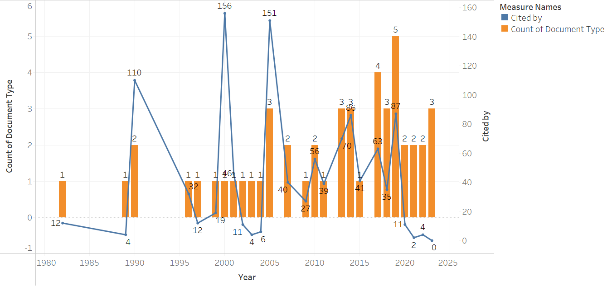
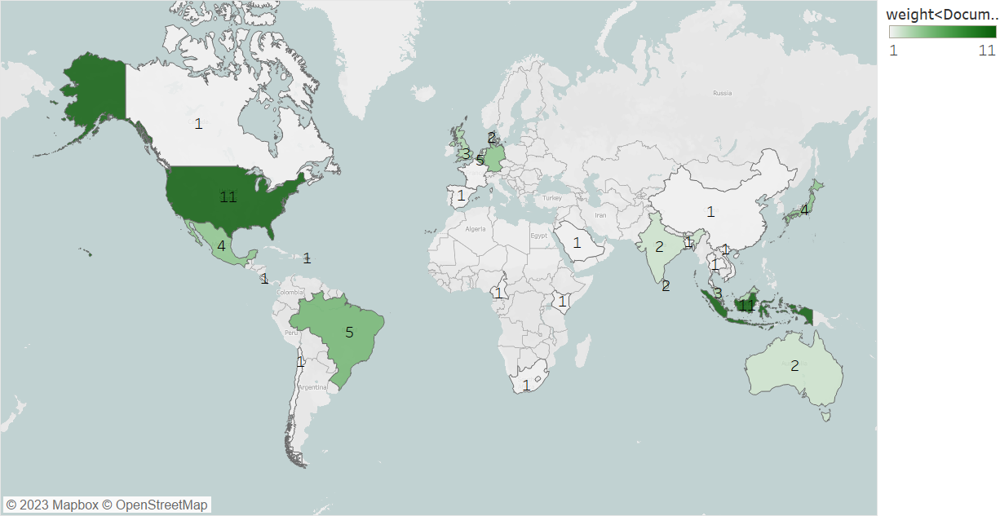
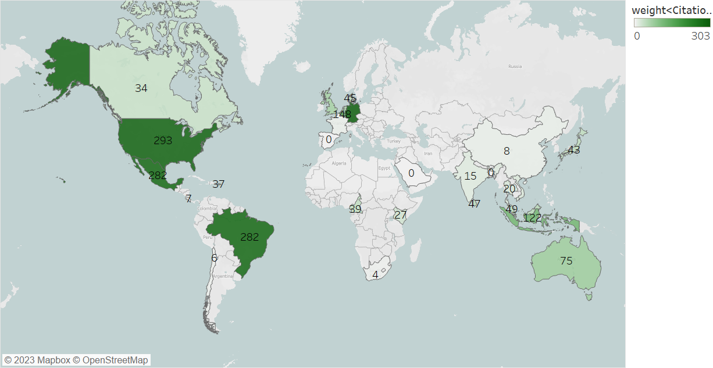
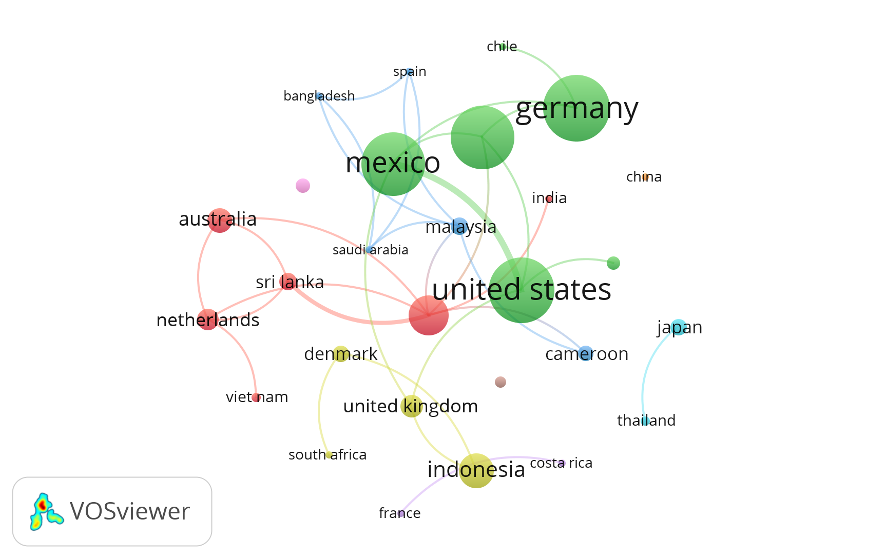
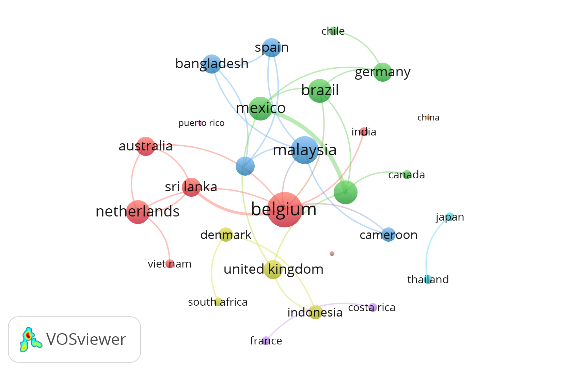
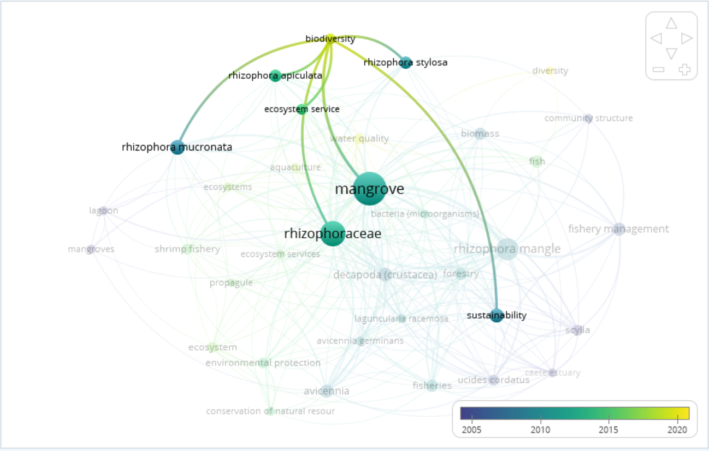
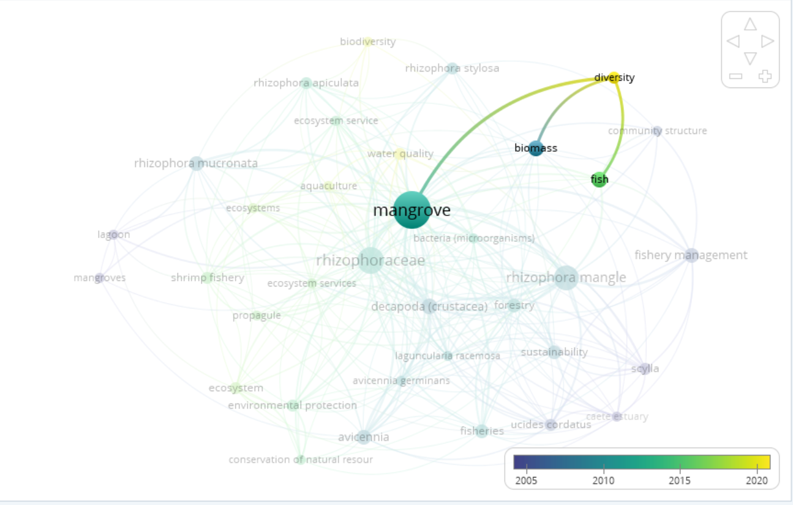
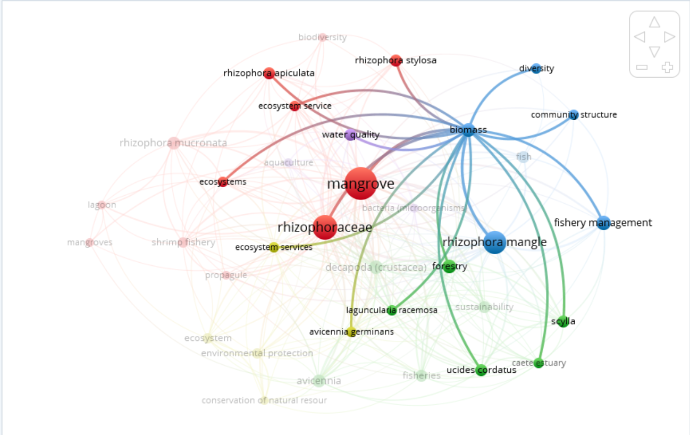
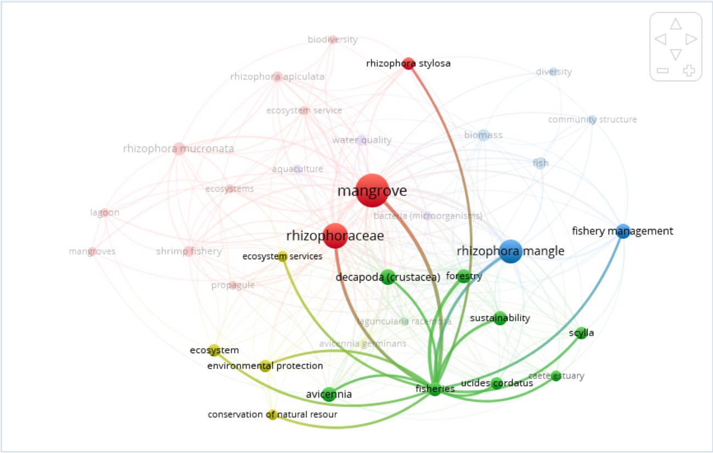
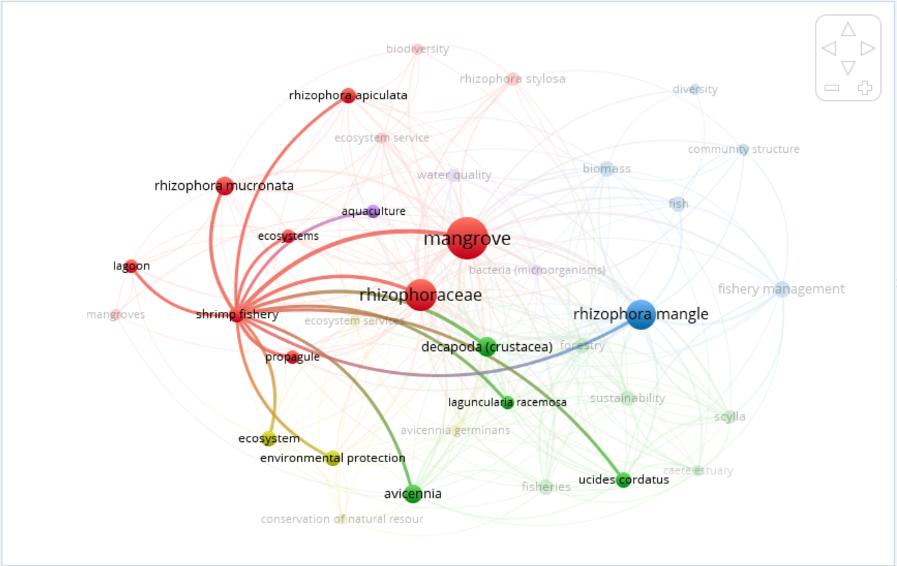

```{r setup, include=FALSE}
knitr::opts_chunk$set(echo = FALSE, warning = FALSE, message = FALSE, dev="cairo_pdf")

```

# Background

<!-- change --> Mangroves are inter-tidal forests that are essential components to many tropical ecosystems. As the effects of climate change grow stronger worldwide, the need for carbon mitigation and protection against extreme weather are becoming more urgent. Mangroves biomes comprise about 14 % of marine carbon sequestration and may result in high gas emissions when these ecosystems are disturbed [@alongiCarbonSequestrationMangrove2012], while more established mangroves are more efficient in absorbing atmospheric carbon [@cameronEstimatingFullGreenhouse2019]. 

MORE ABOUT MANGROVE BACKGROUND. RANGE, WHICH COUNTRIES, BRING UP IN REPLANTING PROJECT? ALSO BRING UP SPECIFICALLY RHIZOPORA AND THEIR RANGE. MAY TELL SOMETHING ABOUT WHY CERTAIN COUNTRIES ARE MORE IMPACTFUL

Beyond their benefits of protecting against extreme weather events, mangroves are also key actors in maintaining the biodiversity of the ecosystems they inhabit. Mangroves have been reported to support up 20% of the benthic biodiversity in their habitats [@carugatiImpactMangroveForests2018]. They provide essential nutrients, temperature controls, and protection from predators for marine life [@blueforestsAdaptiveCollaborativeManagement2012new]. Further, Mangroves have been shown to increase fishery yields in their surrounding areas, therefore increasing fisher income [@aburto-oropezaMangrovesGulfCalifornia2008]. The root systems of mangroves provide shelter and protection for juvenile fish, allowing them to grow and develop safely away from predators and also also act as a buffer against strong currents and waves, creating calmer and more stable environments where fish can feed and reproduce [@alongiMangroveForestsResilience2008]. Areas with intact mangrove forests have been shown to support higher fish abundance and diversity compared to areas without mangroves [@nagelkerkenHabitatFunctionMangroves2008]. Mangroves provide a rich food web, with leaf litter and detritus serving as a source of nutrients that fuel the basis of the food chain, supporting the growth and survival of various fish species [@alongiMangroveForestsResilience2008]. Furthermore, mangroves act as a buffer against coastal erosion and storm surges, safeguarding the habitats of both fish and fishermen [@nagelkerkenHabitatFunctionMangroves2008]. Mangroves offer a crucial line of defense against the impacts of climate change on fisheries. The dense root systems of mangroves stabilize shorelines and protect coastal areas from erosion caused by rising sea levels and extreme weather events [@alongiMangroveForestsResilience2008]. ADD COMMENTS ABOUT SHRIMP FISHERIES

BIBANALYSIS

# RESULTS AND DISCUSSION

## PUBLICATION TRENDS

```{r ThatOneDoc, echo = FALSE, results = "asis", fig.cap = '(ref:thatonedoc) \\label{ThatOneDoc}', out.width = "100%"}



```

(ref:thatonedoc) Trends in number of scientific publications in mangroves and fisheries (the orange barplot) overlayed with the total number of times each of these documents were cited (the blue trendline).

Figure \ref{ThatOneDoc} demonstrates the trends in both number of documents and citations of papers that reference studies on mangroves, fisheries, and *Rhizophora*. The number of documents published have been generally increasing since 1980, indicating an increased interest in the intersection between mangroves and their ecological relationships to fisheries. Further, the most cited papers were published between 1990 and 2005, shortly before this overall increase in publications. This could suggest that these papers had a high impact on this multidisciplinary field and that could have catalyzed this increase in publications. I GUESS SOME SENTENCE ON INCREASED FOCUS ON FISHERIES, ESPECIALLY SMALL SCALE. AS MANGROVES ARE AN ESSENTIAL COMPONENT TO THEIR HEALTH AND SUCCESS

## COUNTRY TRENDS

```{r perCountryOutput, results = 'asis', results = 'asis', echo = FALSE, fig.show = "hold", out.width = "50%", fig.cap = '(ref:percountryoutput) \\label{perCountryOutput}'}




```
(ref:percountryoutput) A) The total number of publications from each country since 1980 ranging from 0-11. B) The total number of times each countrys' papers were cited ranging from 0-303.

We then analyze the impact that each country has on the field of mangroves and their relationship to fisheries. Figure \ref{perCountryOutput} A) demonstrates that both the United States and Indonesia have published the greatest number of papers on mangrove fisheries since 1980. However, in terms if impact measured by the number of citations, The United States, Mexico, Brazil, Germany, and Indonesia have the highest total number of citations in that respective order. This shows that research conducted in countries with significant mangrove presence have largely impacted the field, especially in Mexico and Brazil, which have fewer publications yet are some of the most cited. SOMETHIGN ABOUT FISHERIES IN BRAZIL, MEXICO, INDONESIA.

```{r CitationsPerCountryCluster, echo = FALSE, results = "asis", fig.cap = '(ref:citationspercountrycluster) \\label{CitationsPerCountryCluster}', out.width = "100%", eval = FALSE}



```

<!-- (ref:citationspercountrycluster) Number of citations per country cluster I THINK TAKE OUT -->

```{r linksPerCountry, echo = FALSE, results = "asis", fig.cap = '(ref:linkspercountry) \\label{linksPerCountry}', out.width = "100%"}



```

(ref:linkspercountry) Cluster analysis of the number of collaborations between countries. The different colors represent distinct sets of clusters.

However, the country with the most collaborations with other nations is Belgium (figure {\ref linksPerCountry}). IDK WHAT KIND OF INTERPRETATION YOU WANT TO TAKE FROM THAT. 

## BIOMASS AND FISHERIES

```{r biomassAge, results = 'asis', results = 'asis', echo = FALSE, fig.show = "hold", out.width = "50%", fig.cap = '(ref:biomassage) \\label{biomassAge}'}




```
(ref:biomassage) Shows that biomass and biodiversity are only recent additions to this conversation

Next, we analyzed how the study of ecosystem ecology and fisheries related to mangroves has evolved since the 1980's. Figure \ref{biomassAge} is a cluster analysis showing the year in which common keyword began to appear in literature related to mangroves, fisheries, and *Rhizophora*. Here, despite the fact that fisheries and community structure have been discussed since 2005, conversations focusing on ecological diversity have only recently been incorporated into these discussions.
TALK ABOUT BIODIVERSITY IMPORTANCE

```{r biomassCluster, echo = FALSE, results = "asis", fig.cap = '(ref:biomasscluster) \\label{biomassCluster}', out.width = "100%", eval = FALSE}



```

<!-- (ref:biomasscluster) Despite being a recent addition to the conversation, biomass has a lot of linkages to other concepts -->

```{r fisheryClusters, results = 'asis', results = 'asis', echo = FALSE, fig.show = "hold", out.width = "50%", fig.cap = '(ref:fisheryclusters) \\label{fisheryClusters}'}




```
(ref:fisheryclusters) cluster of fishery vs shrimp fisheries

We also applied this cluster analysis to the 