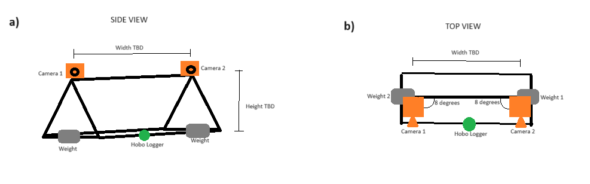

# Questions:

## BF:

* Can I do a test run in Feb or is this only to meet people
* Locations and how to keep track
* Best place to buy PVC
* Water depth of channels
* How wide are the channels
* Water Visibility
* Transport around Island
* Potential of keeping some supplies there (mainly PVC stands)

## Easton:
* How to change orientation based on water visibility
* What to use besides eventMeasure
* Doing measurements in channels. Would it be valuable to have some sort of assessment of biomass of mangroves around?
* Number of replicates. Right now proposal isn't any.

```{r setup, include=FALSE}
knitr::opts_chunk$set(echo = FALSE, warning = FALSE, message = FALSE, dev="cairo_pdf")

```

# Stand Construction

Right now I'm thinking of something like this image, but size will depend on water visibility, depth, and the best way to orient cameras.

```{r URUV, echo = FALSE, fig.cap = 'General camera set up. Dimensions and angles between cameras TBD'}



```

\newpage

# Supply List

* Go Pro Cameras
* Camera Stands
* Chargers and batteries
* hobo loggers and stands for loggers
* Phone if that's how you read out loggers
* Notebook/pencils
* Extra PVC/glue/zipties
* Timer

## To Buy:

* PVC pipe for stand/transect
* PVC Glue
* PVC cutters
* Drill or way to cut holes in PVC
* Zip Ties
* Weights
* Protractor
* Meter Stick
* Sharpies
* Timer
* Flagging or something to demarcate locations
* Bags to protect phone
* Waterproof phone case


## To Do in Makassar:

* Come up with dimensions of stand
* Build Stand
* Calibrate HOBO and cameras
* Do one test run out of water & write data analysis section


# Protocol

## Before Field:

1. Make sure all cameras and hobos are charged and calibrated
2. Mount cameras and hobo onto stand. Ensure cameras sit at a 7 degree angle from one another.
3. Pack the following:

* URUV (and possibly extra stand)
* Extra Cameras/Hobos
* Notebooks/Pencils
* Timers
* Meter Stick

## In Field

4. Travel to field site
5. Deploy URUV. Place contraption on bottom of seafloor. Note camera number, time, HOBO number, and site in Notebook. Note weather conditions
6. After 1 hr 30 minutes, retrieve BRUV. Measure water depth, and do stem counts of .5 m by .5 m transect around BRUV location (might not do this if measurements are taken in channels)
7. Remove URUV and go to next location within a site (DO I WANT TO CHANGE CAMERAS PER SITE). Repeat Deployment
8. After 1 site deployment (right now the goal is one site per day), return home and download all HOBO and camera information onto computer and hard drive. Copy field notebook into excel sheet/cleaner NB and scan field notebook.

\newpage

# Methods - As in Proposal

## Site description:
Pulau Tanakeke (Figure \ref{Tanakeke}) is situated about 40 km southwest of Makassar in South Sulawesi, Takalar Regency. The island is a coral atoll covering about 3,930 hectares. About 392.25 hectares of mangrove has been restored [@cameronEstimatingFullGreenhouse2019]. Access to the island presents a challenge as rough seas make sea crossings difficult during rainy seasons. The island comprises of five villages or desa: Balangdatu,  Maccinibaji, Mattirobaji, Rewataya, and Tompotana. Historically, the island was populated with about 1,776 hectares of Mangroves, most of which has been destroyed for aquaculture.

(ref:tanakeke) A map of Tanakeke Island with village (desa) names (left). The right image shows the mangrove restoration sites on Tanakeke Island by Blue forests. Both images are courtesy of Blue Forests.

```{r Tanakeke, echo = FALSE, fig.show="hold", out.width="45%", results = "asis", fig.cap = '(ref:tanakeke) \\label{Tanakeke}'}

knitr::include_graphics("Tanakeke_Villages.png")
knitr::include_graphics("Tanakeke_Sites.png")

```

## Equipment:
For the video recording data, we will use six SJCAM SJ4000 Action Camera 4K30fps WiFi Cameras. In order to collect the temperature and light data, we will use a HOBO Pendant Temperature/Light 64K Data Logger.

## Data Collection:
In this project, we plan on selecting three different sites across the island. Within each site, we will locate a recently restored mangrove, mangroves that were restored over ten years ago, and an area where mangroves have not been rehabilitated yet. Recently restored mangrove sites will be in Lantangpeo, where Blue Forests is currently working on mangrove rehabilitation (Figure \ref{Tanakeke}). Sites that have been restored over ten years ago and unrestored sites will be located in Tompotanah and Ujungtanah (Figure \ref{Tanakeke}). At each site, we will place two cameras at 1m depth facing horizontally at a 7 degree angle from one another in order to measure fish length and water visibility. Next to the cameras, we will place the light and temperature loggers which will collect throughout the duration of filming. With two cameras per location, this will total 18 cameras deployments per month for nine months between February 2024 and October 2024.<!-- TIMING --> Cameras will record for 1 hour. After which, the cameras and loggers will be extracted from the site, the recording will be downloaded, and then the cameras will be moved to the next site where we will conduct the same experiment. Sampling of each site will occur on a monthly basis.<!-- NONINVASIVE --> Methodology in this research will involve only observation and observation with video. No direct contact with animals will occur over the course of this project.<!-- NONINVASIVE -->

## Analysis:
We will measure biodiversity using the MaxN calculation method, as it is the most robust calculation for relative abundance [@whitmarshWhatBigBRUVver2017]. Further, we will use the data collected from the temperature and light loggers to create a statistical model of fish abundance in order to determine if fish abundance is more attributed to decreased water temperature or the shaded areas provided by mangrove habitats.
Expected Result
As has been found in previous literature, we expect the sites with older, more established mangroves to foster the most biodiversity of juvenile fishes due to better shelter from predators and cooler temperatures. We expect the areas with no mangrove restoration to exhibit the least amount of biodiversity due to the exposure of these environments to predators and higher temperatures.

# Source of Funds
Fulbright Grant: ~ $20,800

# Research Location
Pulau Tanakeke, Takalar Regency, South Sulawesi Province, Indonesia (Figure \ref{Tanakeke}).

# Data Management Plan
Raw video data will be taken from the cameras and stored on a portable external hard drive as well as into my personal Google Drive account. We will also submit the raw data to BRIN's data repository, as well as any notes taken during field excursions. Any notes, observation data, and analyses will be conducted on my personal computer and backed up in GitHub.