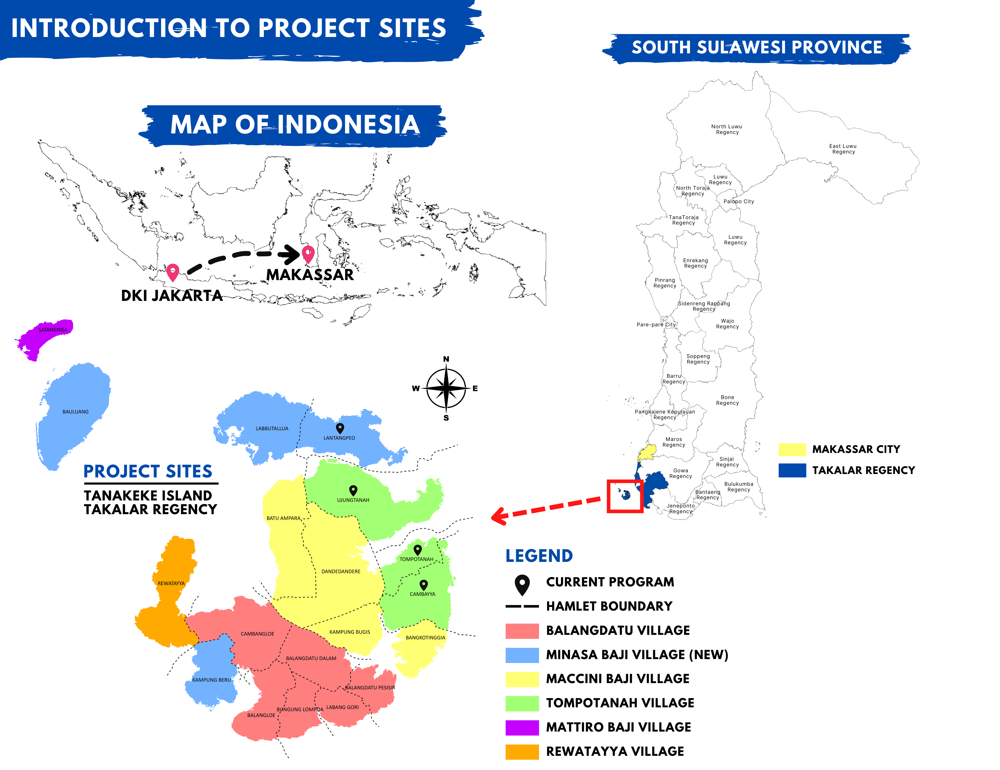

\newpage

\doublespace

```{r setup, include=FALSE}
knitr::opts_chunk$set(echo = FALSE, warning = FALSE, message = FALSE, dev="cairo_pdf")
#knitr::write_bib look into


library(plyr)
library(dplyr)
library(ggplot2)
library(lubridate)
library(ggpubr)


setwd("C:/Users/Sophi/Documents/GitHub/TanakekeProject/URUVS")

URUV_data <- read.csv("Datasheets/MasterRecordingData_clean.csv")

```

# Abstract

Mangroves are an essential biome for many tropical ecosystems and coastal communities. They exhibit high carbon sequestration, protect coastal areas from floods and extreme weather events, and foster biodiversity in their habitats. They have also been shown to increase fish stocks in surrounding fisheries. As the country with the most extensive mangrove habitats in the world, the Indonesian government has committed to restoring 600,000 hectars of mangroves throughout the country. One such place where this restoration effort is taking place is Pulau Tanakeke in South Sulawesi. Here, an NGO called Blue Forests has been conducing mangrove restoration since 2012. In the project, we use Unbaited Remote Underwater Video to assess how these replanting efforts are effecting local fish stocks and biodiversity. We compare three types of mangrove forests: natural (old-growth forests), EMR (replanted mangroves), and areas with destroyed mangroves. We have found that destroyed sites have the lowset fish biodiversity as well as total number of fish present. Natural mangroves had the highest fish biodiversity. There were certain species such as cardinal fish which greatly preferred the EMR sites, but total number of fish were highest in the EMR and natural sites. This research serves to show the benefits of mangroves for small scale fisheries and highlights the importance of environmental restoration for ensuring food security.

\newpage


# Introduction: 

Mangroves are inter-tidal forests that are essential components to many tropical ecosystems. As the effects of climate change grow stronger worldwide, the need for carbon mitigation and protection against extreme weather are becoming more urgent. Mangroves biomes comprise about 14 % of marine carbon sequestration and may result in high gas emissions when these ecosystems are disturbed [@alongiCarbonSequestrationMangrove2012], while more established mangroves are more efficient in absorbing atmospheric carbon [@cameronEstimatingFullGreenhouse2019]. Beyond their benefits of protecting against extreme weather events, mangroves are also key actors in maintaining the biodiversity of the ecosystems they inhabit. Mangroves have been reported to support up 20% of the benthic biodiversity in their habitats [@carugatiImpactMangroveForests2018]. They provide essential nutrients, temperature controls, and protection from predators for marine life [@blueforestsAdaptiveCollaborativeManagement2012new]. Further, Mangroves have been shown to increase fishery yields in their surrounding areas, therefore increasing fisher income [@aburto-oropezaMangrovesGulfCalifornia2008]. The root systems of mangroves provide shelter and protection for juvenile fish, allowing them to grow and develop safely away from predators and also also act as a buffer against strong currents and waves, creating calmer and more stable environments where fish can feed and reproduce [@alongiMangroveForestsResilience2008]. Areas with intact mangrove forests have been shown to support higher fish abundance and diversity compared to areas without mangroves [@nagelkerkenHabitatFunctionMangroves2008]. Mangroves provide a rich food web, with leaf litter and detritus serving as a source of nutrients that fuel the basis of the food chain, supporting the growth and survival of various fish species [@alongiMangroveForestsResilience2008]. Furthermore, mangroves act as a buffer against coastal erosion and storm surges, safeguarding the habitats of both fish and fishermen [@nagelkerkenHabitatFunctionMangroves2008]. Mangroves offer a crucial line of defense against the impacts of climate change on fisheries. The dense root systems of mangroves stabilize shorelines and protect coastal areas from erosion caused by rising sea levels and extreme weather events [@alongiMangroveForestsResilience2008]. As the largest archipelago in the world, marine fisheries are an extremely important resource in Indonesia for food security and fisher income. Fisheries contribute to about 3% of the GDP in Indonesia, and over 80% of fishery catches are from small scale fisheries, however these systems are currently subject to over-exploitation, threatening the food security of those who are reliant on these fisheries [@ayundaImpactSmallScaleFisheries2018].

Despite all of their contributions to ecosystem health, mangrove environments are being threatened worldwide. Rising sea-levels has been shown to be a major contributor to mangrove loss [@gilmanThreatsMangrovesClimate2008]. Further, as extreme events are becoming more intense and more frequent, these could potentially threaten mangroves due to defoliation, soil erosion, or by altering the chemical makeup or temperature of soils [@gilmanThreatsMangrovesClimate2008]. Mangroves are also directly threatened by anthropogenic activity. Pollution, coastal development, and aquaculture development have also contributed to mangrove ecosystem loss [@adeelAssessmentManagementMangrove2002]. Mangrove forests in the Western Tropical Pacific are the most diverse of these habitats globally [@ellisonOriginsMangroveEcosystems1999]. Indonesia has the most extensive mangrove forests in the world [@kusmanaManagementMangroveEcosystem2011]. As Indonesia is also the largest archipelagic country, mangroves’ contribution to flood protection and extreme weather mitigation is vital to the health and safety of many of its inhabitants. However, due to timber production, aquaculture, and human development, the Ministry of Forestry reported in 2007 that around 69% of mangroves were in damaged condition in the country [@kusmanaManagementMangroveEcosystem2011]. As a response to this habitat loss, the Indonesian government has committed to restoring 600,000 hectares of mangroves in the country in 2024, the most ambitious mangrove restoration project in the world. Tanakeke Island in South Sulawesi, Takalar Regency, is one location where this restoration effort is taking place. Here, mangrove habitats are generally privately owned, and the main driver of mangrove loss has been timber production and shrimp aquaculture [@blueforestsAdaptiveCollaborativeManagement2012new]. 1,200 hectares of mangroves were converted into aquaculture ponds in the 1980s and 1990s, which is about 70% of its historical cover [@brownCASESTUDYCommunity]. Recently, there have been reports of increased flooding on this island which could be attributed to the loss of protection from mangroves [@blueforestsAdaptiveCollaborativeManagement2012new]. However, in response to mangrove restoration, the community has seen great success in both engagement and successful mangrove rehabilitation, where hundreds of community members have participated since the 1990’s [@blueforestsAdaptiveCollaborativeManagement2012new; @PresentTanakekeIsland2013]. Further, small scale fishing is an essential part of peoples’ livelihoods on Tanakeke. Locally caught seafood is the main source of protein on this island [@blueforestsAdaptiveCollaborativeManagement2012new]. 

Mangroves provide refuge for about 55% fish catch biomass in Indonesia [@theworldbankNewProjectWill2022new]. Fisher income has been shown to be negatively affected by mangrove habitat loss, and because of this, the financial gain of mangrove restoration is predicted to be more lucrative than any alternative land use such as aquaculture [@yamamotoLivingEcosystemDegradation2023]. For this reason, mangroves are an essential component to the health of Indonesia’s fisheries and contribute significantly to the food security of those directly reliant on small scale fisheries as a key source of nutrition, including on Tanakeke Island [@blueforestsAdaptiveCollaborativeManagement2012new]. While these mangrove restoration efforts have resulted in increased flood prevention and ecotourism, little research has been done to assess the improvements in marine biodiversity and benefits to fish stocks. In this project, we aim to understand how this restoration is affecting local marine biodiversity and the sustainability of commercially fished species on Tanakeke Island.

The outcomes of this project will be to disseminate its results to the local community. This will be done with the aid of Blue Forests, an NGO that oversees mangrove replanting on this island and facilitates community action and engagement in this restoration project. With their help, we will incorporate the results of this study into their curriculum for educating the public on the benefits of mangroves. Further, at Universitas Hasanuddin, I will assist in Dr. Ambo Rappe's lab by leading data science and coding seminars for graduate and undergraduate students at the University in order to help them learn data organization and analysis for their own projects. Finally, with the help of Dr. Ambo Rappe, we intend on publishing this research an international journal.

## Hypotheses 

Due to the environmental benefits of mangroves, we hypothesize that both total MaxN and biodiversity will be highest in natural mangrove areas. We also hypothesize that areas that have undergone mangrove replanting will have increased the total MaxN and biodiversity when compared to destructed sites.

# Objectives

1. Determine the effect of mangrove restoration on the fishery production on Pulau Tanakeke, Takalar Regency, South Sulawesi Province, Indonesia.

2. Uncover what aspects of mangrove cover is most beneficial to juvenile fish populations (i.e. reductions in water temperature, shade, or increased plant biomass).

3. Disseminate these findings to the local community on Tanakeke with the help of the NGO Blue Forest as part of their community engagement program as well as publish findings to international scientific journals.

## Site Description

Pulau Tanakeke (Figure \ref{Tanakeke}) is situated about 40 km southwest of Makassar in South Sulawesi, Takalar Regency. The island is a coral atoll covering about 3,930 hectares. About 392.25 hectares of mangrove has been restored [@cameronEstimatingFullGreenhouse2019]. Access to the island presents a challenge as rough seas make sea crossings difficult during rainy seasons. The island comprises of five villages or desa: Balangdatu,  Maccinibaji, Mattirobaji, Rewataya, and Tompotana. Historically, the island was populated with about 1,776 hectares of Mangroves, most of which has been destroyed for aquaculture.

(ref:tanakeke) A map of Tanakeke Island with village (desa) names (left). The right image shows the mangrove restoration sites on Tanakeke Island by Blue forests. Both images are courtesy of Blue Forests.

```{r Tanakeke, echo = FALSE, fig.show="hold", out.width="45%", results = "asis", fig.cap = '(ref:tanakeke) \\label{Tanakeke}'}


knitr::include_graphics("Tanakeke_Sites.png")

```

## Reason for selecting the method that being used. 

We used Unbaited Remote Underwater Video (URUV) methods which are non-invasive and cost effective. Methodology in this research involved only observation and observation with video. No direct contact with animals occurred over the course of this project. We used URUV to assess the marine biodiversity of mangrove habitats and compare them to the biodiversity of areas that have not undergone mangrove rehabilitation. 

# Result and Discussion:  

Figure \ref{FishSpecies} Shows the distribution of the number of fish species in each desa, as well as in each site type. Here we can see that the median number of fish species is similar in both Lantangpeo and Tompotanah. However, when the data is organized by site type, both the EMR and Lush sites had higher numbers of fish species when compared to the destructed site.

(ref:fishspecies) Distribution of number of fish species found per video organized by a) desa and b) site type.

```{r FishSpecies, results = 'asis', echo = FALSE, fig.show = "hold", out.width = "50%", fig.cap = '(ref:fishspecies) \\label{FishSpecies}'}

ggplot(URUV_data, aes(x=DESA, y=NO_FISHSPECIES)) + 
  geom_boxplot() 
  #geom_jitter(shape=16, position=position_jitter(0.1))

ggplot(URUV_data, aes(x=SITE_TYPE, y=NO_FISHSPECIES)) + 
  geom_boxplot() 
  #geom_jitter(shape=16, position=position_jitter(0.1))

```

MaxN was then totaled across all of the months for each site type (Figure \ref{JumlahIkan}). Both EMR and Lush mangrove sites have the highest total number of ikan found. Here, the highest total was found in EMR sites. However, cardinal fish were a huge contributor to this datapoint, with 293 found in EMR sites and only 58 found in Lush mangroves. If this species is removed from the count, lush mangroves have the highest total MaxN.


(ref:jumlahikan) Total MaxN found in each site type

```{r JumlahIkan, echo = FALSE, fig.cap = '(ref:jumlahikan) \\label{JumlahIkan}'}

    ikanTotal <- URUV_data %>%
      group_by(SITE_TYPE) %>%
      summarise(TOTAL_FISH = sum(MAXN_TOTAL))
    
    ggplot(data=ikanTotal, aes(x=SITE_TYPE, y=TOTAL_FISH, fill = SITE_TYPE)) +
      geom_bar(stat="identity", color = "black") +
      xlab("Jenis Mangrove") +
      ylab(paste("Jumlah Ikan", "Total MaxN")) +
      geom_text(aes(label=TOTAL_FISH), vjust=-0.3, size=3.5) +
      theme_minimal() +
      scale_fill_manual(values = c("#b41515", "#ffff00", "#0474c4"),
                    labels = c("Dihancur","EMR", "Alami")) +
      theme(legend.title=element_blank())

```

Shannon's Diversity Index was then counted across all of the months. Here in Figure \ref{ShannonsDiversity} EMR and Lush sites have the highest diversity when compared to the destructed sites.

(ref:shannonsdiversity) Total Shannon's Diversity Index found in each site type.

```{r ShannonsDiversity, echo = FALSE, fig.cap = '(ref:shannonsdiversity) \\label{ShannonsDiversity}'}

# MAKE LIST OF SPECIES NOT TO INCLUDE UNIDGUPPY, 

# DOUBLE CHECK THIS CALCULATION. based off this https://sqlpad.io/tutorial/shannon-diversity-calculate/

# # Sample data: species counts
# species_counts <- c(10, 20, 30, 40)
# 
# # Calculate proportions
# species_proportions <- species_counts / sum(species_counts)
# 
# # Calculate Shannon Diversity Index
# shannon_diversity <- -sum(species_proportions * log(species_proportions))
# print(shannon_diversity)


shannon <- URUV_data %>%
      group_by(SITE_TYPE) %>%
      summarise(SHANNON_AVG = mean(SHANNON_DIV))

ggplot(data=shannon, aes(x=SITE_TYPE, y=SHANNON_AVG, fill = SITE_TYPE)) +
      geom_bar(stat="identity", color = "black") +
      xlab("Jenis Mangrove") +
      ylab("Index") +
      #geom_text(aes(label=SHANNON_AVG), vjust=-0.3, size=3.5) +
      theme_minimal() +
      scale_fill_manual(values = c("#b41515", "#ffff00", "#0474c4"),
                    labels = c("Dihancur","EMR", "Alami")) +
      theme(legend.title=element_blank())

```


```{r ANOVA_total, echo = FALSE, fig.cap = '(ref:anova_total) \\label{ANOVA_total}'}

# LATER maybe try a PCA https://builtin.com/data-science/step-step-explanation-principal-component-analysis

# ONE WAY ANOVA CHECKING EFFECT OF SITE AND DESA
# https://www.scribbr.com/statistics/anova-in-r/

one.way_Overall <- aov(MAXN_TOTAL ~ SITE_TYPE, data = URUV_data)
summary(one.way_Overall)

one.way_Desa <- aov(MAXN_TOTAL ~ DESA, data = URUV_data)
summary(one.way_Desa)

cat("The ANOVA test shown above shows that site type has a significant effect on the total \n number of fish found in a site with a p value of 0.00068. Desa also has a somewhat \n significant effect with a P value of .127")


```


## The benefit for Indonesian development program.  

The results above all indicate that lush mangroves and EMR sites have higher total numbers of fish and biodiversity in those areas. Therefore, the community and Blue Forests' efforts to replant mangroves on Tanakeke island have shown indirect benefits such as increasing fish biodiversity and supporting fish stocks.

# Conclusion, include:  
## Crucial points which may be encountered from research result.

Mangrove replanting has increased fish stocks and biodiversity on Tanakeke island


## Problem solving of research, encouraging or discouraging of hypotheses stated in the research  objectives.

Our hypothesis was supported as the number of fish were increased in EMR and natural mangrove areas


\newpage