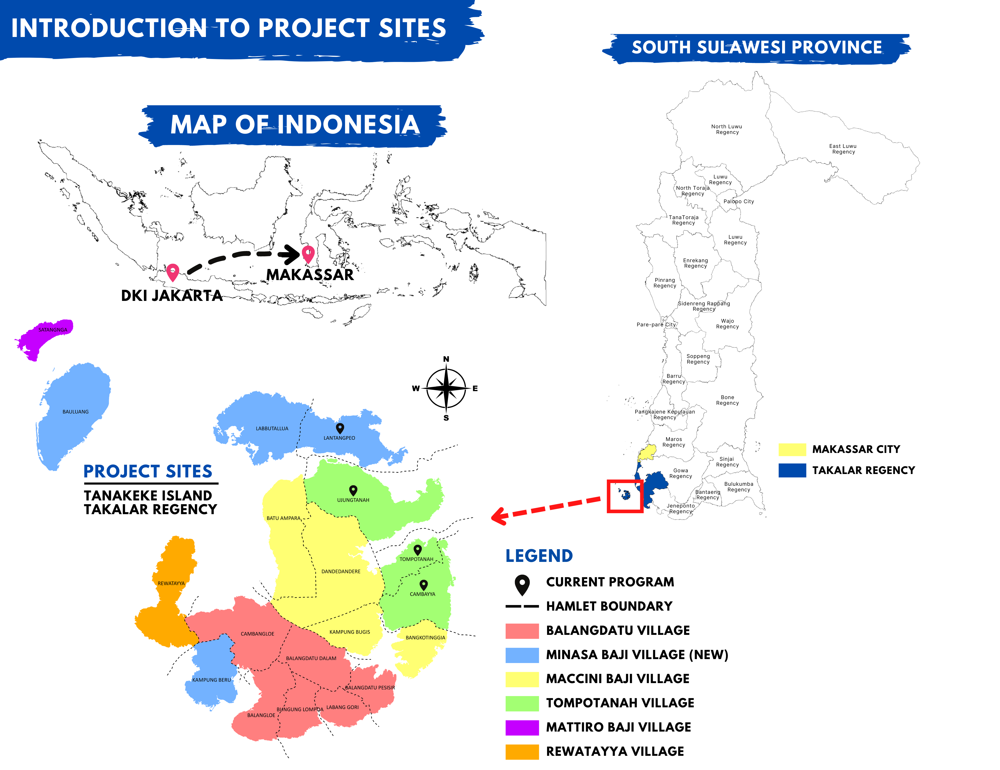

---
output:
  bookdown::pdf_document2:
    fig_caption: yes
    toc: no
    keep_tex: yes
  pdf_document:
    toc: no
  bookdown::html_document2:
    fig_caption: yes
    toc: no
  word_document: default
bibliography:
- BRIN_Prop.bib
- BRIN_Prop2.bib
header-includes:  \usepackage{lineno} \usepackage{placeins} \usepackage{setspace}\doublespacing
editor_options: 
  chunk_output_type: console
---

\begin{center}
	
\textbf{\Large The effects of mangrove restoration on fish stocks and marine biodiversity in Indonesia}
	
\textsc{Sophie Wulfing$^{1*}$, Muhammad Sahid$^{1}$, Rohani Ambo-Rappe$^{3}$, and Easton R. White$^{1}$}
\vspace{3 mm}
\normalsize{\indent $^1$Department of Biological Sciences, University of New Hampshire, 03824, NH, USA \\ $^2$Blue Forests Foundation, Makassar, South Sulawesi, Indonesia \\ $^3$Marine Science Department, Faculty of Marine Science and Fisheries, University of Hasanuddin, Makassar, South Sulawesi, Indonesia}
$\text{*}$ Corresponding author: Sophie Wulfing (SophieWulfing@gmail.com)
\end{center}

\newpage

```{r setup, include=FALSE}
knitr::opts_chunk$set(echo = FALSE, warning = FALSE, message = FALSE, dev="cairo_pdf")
#knitr::write_bib look into

library(tidyr)
library(plyr)
library(dplyr)
library(ggplot2)
library(lubridate)
library(ggpubr)
library(knitr)
library(kableExtra)


setwd("C:/Users/swulfing/Documents/GitHub/TanakekeProject/URUVS")

URUV_data <- read.csv("Datasheets/MasterRecordingData_clean.csv")

ID_data <- read.csv('Datasheets/URUV/speciesguide.csv')
Bahasa_data <- read.csv('Datasheets/URUV/speciesBahasa.csv') %>%
  select(Name_Data, Name_Local, Ditangkap) %>%
  rename(dataCode = Name_Data)

ID_data <- merge(x = ID_data, y = Bahasa_data, by = 'dataCode')

URUV_data$MONTH <- factor(URUV_data$MONTH, levels = c("JANUARY", "FEBRUARY", "MARCH", "APRIL", "MAY", "JUNE", "JULY", "AUGUST", "SEPTEMBER", "OCTOBER", "NOVEMBER", "DECEMBER"))
URUV_data$SITE_TYPE <- factor(URUV_data$SITE_TYPE, levels = c("D", "E", "L"))
URUV_data$DESA <- factor(URUV_data$DESA)

ID_data$REPEAT <- NA

for(i in 1:nrow(ID_data)){
  if(ID_data$NameChanged[i] %in% ID_data$dataCode){
    
    ID_data$REPEAT[i] <- 1
    
  }
  
}

ID_data <- ID_data %>%
  filter(is.na(REPEAT))

```

# ABSTRACT

Mangroves are an essential biome for many tropical ecosystems and coastal communities. They exhibit high carbon sequestration, protect coastal areas from floods and extreme weather events, and foster biodiversity in their habitats. They have also been shown to increase fish stocks in surrounding fisheries. As the country with the most extensive mangrove habitats in the world, the Indonesian government has committed to restoring 600,000 hectars of mangroves throughout the country. One such place where this restoration effort is taking place is Pulau Tanakeke in South Sulawesi. Here, an NGO called Blue Forests has been conducing mangrove restoration since 2012. In the project, we use Unbaited Remote Underwater Video to assess how these replanting efforts are effecting local fish stocks and biodiversity. We compare three types of mangrove forests: natural (old-growth forests), EMR (replanted mangroves), and areas with destroyed mangroves. We have found I WILL FILL THIS IN ONCE WE KIND OF PARSE OUT WHAT I WANT TO CONCLUDE. This research serves to show the benefits of mangroves for small scale fisheries and highlights the importance of environmental restoration for ensuring food security.

# INTRODUCTION

Mangroves are inter-tidal forests that are essential components to many tropical ecosystems. As the effects of climate change grow stronger worldwide, the need for carbon mitigation and protection against extreme weather are becoming more urgent. These biomes comprise about 14 % of marine carbon sequestration and may result in high gas emissions when these ecosystems are disturbed [@alongiCarbonSequestrationMangrove2012], while more established mangroves are more efficient in absorbing atmospheric carbon [@cameronEstimatingFullGreenhouse2019]. Beyond their benefits of protecting against extreme weather events, mangroves are also key actors in maintaining the biodiversity of the ecosystems they inhabit. Mangroves have been reported to support up 20% of the benthic biodiversity in their habitats [@carugatiImpactMangroveForests2018]. They provide essential nutrients, temperature controls, and protection from predators for marine life [@blueforestsAdaptiveCollaborativeManagement2012new]. Further, Mangroves have been shown to increase fishery yields in their surrounding areas, therefore increasing fisher income [@aburto-oropezaMangrovesGulfCalifornia2008]. The root systems of mangroves provide shelter and protection for juvenile fish, allowing them to grow and develop safely away from predators and also act as a buffer against strong currents and waves, creating calmer and more stable environments where fish can feed and reproduce [@alongiMangroveForestsResilience2008]. Areas with intact mangrove forests have been shown to support higher fish abundance and diversity compared to areas without mangroves [@nagelkerkenHabitatFunctionMangroves2008]. Mangroves provide a rich food web, with leaf litter and detritus serving as a source of nutrients that fuel the basis of the food chain, supporting the growth and survival of various fish species [@alongiMangroveForestsResilience2008]. Furthermore, mangroves act as a buffer against coastal erosion and storm surges, safeguarding the habitats of both fish and fishermen [@nagelkerkenHabitatFunctionMangroves2008]. Mangroves offer a crucial line of defense against the impacts of climate change on fisheries. The dense root systems of mangroves stabilize shorelines and protect coastal areas from erosion caused by rising sea levels and extreme weather events [@alongiMangroveForestsResilience2008]. As the largest archipelago in the world, marine fisheries are an extremely important resource in Indonesia for food security and fisher income. Fisheries contribute to about 3% of the GDP in Indonesia, and over 80% of fishery catches are from small scale fisheries, however these systems are currently subject to over-exploitation, threatening the food security of those who are reliant on these fisheries [@ayundaImpactSmallScaleFisheries2018]. 

Despite all of their contributions to ecosystem health, mangrove environments are being threatened worldwide. Rising sea-levels has been shown to be a major contributor to mangrove loss [@gilmanThreatsMangrovesClimate2008]. Further, as extreme events are becoming more intense and more frequent, these could potentially threaten mangroves due to defoliation, soil erosion, or by altering the chemical makeup or temperature of soils [@gilmanThreatsMangrovesClimate2008]. Mangroves are also directly threatened by anthropogenic activity. Pollution, coastal development, and aquaculture development have also contributed to mangrove ecosystem loss [@adeelAssessmentManagementMangrove2002]. Mangrove forests in the Western Tropical Pacific are the most diverse of these habitats globally [@ellisonOriginsMangroveEcosystems1999]. Indonesia has the most extensive mangrove forests in the world [@kusmanaManagementMangroveEcosystem2011]. As Indonesia is also the largest archipelagic country, mangroves’ contribution to flood protection and extreme weather mitigation is vital to the health and safety of many of its inhabitants. However, due to timber production, aquaculture, and human development, the Ministry of Forestry reported in 2007 that around 69% of mangroves were in damaged condition in the country [@kusmanaManagementMangroveEcosystem2011]. As a response to this habitat loss, the Indonesian government has committed to restoring 600,000 hectares of mangroves in the country in 2024, the most ambitious mangrove restoration project in the world.

Tanakeke Island in South Sulawesi, Takalar Regency, is one location where this restoration effort is taking place. Here, mangrove habitats are generally privately owned, and the main driver of mangrove loss has been timber production and shrimp aquaculture [@blueforestsAdaptiveCollaborativeManagement2012new]. 1,200 hectares of mangroves were converted into aquaculture ponds in the 1980s and 1990s, which is about 70% of its historical cover [@brownCASESTUDYCommunity]. Recently, there have been reports of increased flooding on this island which could be attributed to the loss of protection from mangroves [@blueforestsAdaptiveCollaborativeManagement2012new]. However, in response to mangrove restoration, the community has seen great success in both engagement and successful mangrove rehabilitation, where hundreds of community members have participated since the 1990’s [@blueforestsAdaptiveCollaborativeManagement2012new; @PresentTanakekeIsland2013]. Further, small scale fishing is an essential part of peoples’ livelihoods on Tanakeke. Locally caught seafood is the main source of protein on this island [@blueforestsAdaptiveCollaborativeManagement2012new]. Mangroves provide refuge for about 55% fish catch biomass in Indonesia [@theworldbankNewProjectWill2022new]. Fisher income has been shown to be negatively affected by mangrove habitat loss, and because of this, the financial gain of mangrove restoration is predicted to be more lucrative than any alternative land use such as aquaculture [@yamamotoLivingEcosystemDegradation2023]. For this reason, mangroves are an essential component to the health of Indonesia’s fisheries and contribute significantly to the food security of those directly reliant on small scale fisheries as a key source of nutrition, including on Tanakeke Island [@blueforestsAdaptiveCollaborativeManagement2012new]. While these mangrove restoration efforts have resulted in increased flood prevention and ecotourism, little research has been done to assess the marine biodiversity and benefits to fish stocks. In this project, we aim to understand how this restoration is affecting local marine biodiversity and abundance of fish species on Tanakeke Island. We will use Unbaited Remote Underwater Video (URUV) methods to assess the marine biodiversity of mangrove habitats and compare them to the biodiversity of areas that have not undergone mangrove rehabilitation.

# METHODS

## Site description:

Pulau Tanakeke (Figure \ref{Tanakeke}) is situated about 40 km southwest of Makassar in South Sulawesi, Takalar Regency. The island is a coral atoll covering about 3,930 hectares. About 392.25 hectares of mangrove has been restored [@cameronEstimatingFullGreenhouse2019]. Access to the island presents a challenge as rough seas make sea crossings difficult during rainy seasons. The island comprises of five villages or desa: Balangdatu,  Maccinibaji, Mattirobaji, Rewataya, and Tompotana. Historically, the island was populated with about 1,776 hectares of Mangroves, most of which has been destroyed for aquaculture.

(ref:tanakeke) A map of Tanakeke Island with village (desa) names (left). The right image shows the mangrove restoration sites on Tanakeke Island by Blue forests. Both images are courtesy of Blue Forests. I'M ALSO WAITING ON A MAP FROM AIS WITH THE VILLAGES AND THE SITES WE SAMPLED

```{r Tanakeke, echo = FALSE, fig.show="hold", out.width="45%", results = "asis", fig.cap = '(ref:tanakeke) \\label{Tanakeke}'}


knitr::include_graphics("Tanakeke_Sites.png")

```

## URUVs

The study was conducted on Tanakeke Island in the Takalar Regency of South Sulawesi, Indonesia in the villages of Tompotanah and Lantangpeo (Fig AIS IS MAKING A MAP). In each village, mangroves were classified into three type: degraded, natural and EMR. EMR (Ecological Mangrove Restoration) refers to a low-cost, socially focused mangrove restoration method used by Blue Forests where local communities are involved in every step of the restoration process, and various mangrove replanting techniques are applied to the restoration site. Three drop sites were selected in each mangrove type in each village based on mangrove type, water depth, and permission from land owners. Further, cameras were placed next to vegetation because this reduced the likelihood of boat traffic knocking over camera stands. 

URUV methods followed standard BRUV methods outlined in LANGLOISE ET AL 2018 AND 2020 but bait was not used. GoPro SJCAM SJ4000 Action Camera 4K30fps WiFi Cameras were installed on a 1 meter-tall PVC pipe partially buried in the sediment. Two villages were sampled and three cameras were installed in each village in each mangrove type, a total of 18 sites (GIVE FIGURE, ASK AIS). The cameras were deployed horizontally to the ground with an additional 1 m PVC pipe extending parallel to the ground below the camera so that the length of that pipe was visible in the video. Tick marks spaced 10 cm apart were painted onto the pipe visible in the video. This allowed for a standardization of water visibility, as the number of ticks was counted for each video vile. Because this region experiences a wide tidal range, with mangrove forests being fully exposed to air at low tide, camera depths varied as they were deployed at high tide between the hours of 06:30 and 18:30 MAKE SURE THAT'S STILL TRUE to ensure sufficient sunlight and that the camera stayed fully submerged during the duration of filming. Cameras faced vegetation in all sites. Site locations were chosen based on low-boat traffic and consent of the landowner. Date, time of day, tide height, water height at location, weather, and water temperature were recorded at each data collection.

## Video Analysis > ALSO CHANGE BASED ON WHAT TYPES OF ANALYSES YOU RUN

Camera calibrationswere conducted by counting the number of tick marks visible on the extending PVC pipe. Videos were then cut to approximately one hour, starting from five minutes after the camera was set. Videos were watched manually on Windows Media Player and MaxN and T1st were counted and recorded for each fish species found on the video. Fish were identified down the lowest possible taxonomic level and crabs were identified at the family-level. Gastropods were not counted as video-clarity was not sufficient to get accurate counts. A sub-sample of images were cross checked in order to avoid misidentified fish species, and species were identified using BOOKS ON DROPBOX, ALLEN BOOOK ON UOUR SHELF. Further, we gathered input from members from both villages, Tompotanah and Lantangpeo, to collect locally-used names in the Makassar Language.

THIS WILL CHANGE BASED ON WHAT YOU END UP REPORTING
After video data was analyzed and fish species were identified and counted, data was analyzed using RStudio software (CITE). At each village and mangrove type, total fish, total species of fish, and Shannon’s Diversity Index (CITE) was calculated. We also conducted an ANOVA analysis on the mangrove type and village to see if habitat preference was significantly different for fish.

TROPHIC ANALYSIS

# RESULTS

START BY OUTLINE TOTAL DATA COLLECTED, # FISH SPECIES, %IDED TO SPECIES LEVEL, DAYS, TIDES, ETC.

FIRST FIGURE (BESIDES MAP OF SITES) WILL BE TIME SERIES OF DATA
    WE SEE A DIP IN DIVERSITY AROUND JUNE BUT NOT IN TOTAL NUMBER OF FISH FOUND
    

(ref:speciesfound) All animal groups found in video analysis. Village fishers were then asked for fish names used locally in the Makassar language. TO DO: FILL IN INDO NAME FOR MISSING, TAKE OUT NON-FISH, EXPLAIN LOCAL NAME MAY HAVE COME FROM TWO SOURCES

```{r speciesFound, echo = FALSE, fig.show="hold", results = "asis", fig.cap = '(ref:speciesfound) \\label{speciesFound}'}


ID_dataCLEAN <- ID_data %>%
  select(SpeciesName, LevelID, CommonName_ENG, CommonName_IND, Name_Local, Ditangkap) %>%
  arrange(SpeciesName) %>%
  mutate(LevelID = na_if(LevelID, "")) %>%
  mutate(Catch = case_when(
    Ditangkap == "dimakan"     ~ 'Yes',
    Ditangkap == "sebagai umpan" ~ 'Yes*',
    Ditangkap == 'hias' ~ 'Yes**',
    Ditangkap == '' ~ 'No'
  )) %>%
  select(!Ditangkap)

colnames(ID_dataCLEAN) <- c('Group Name','ID Level','Common Name (Eng)','Common Name (Ind)', 'Pulau Tanakeke Local Name', 'Locally Caught')

kable(ID_dataCLEAN, caption = 'Animal groups identified. I WILL GET LOCAL NAMES SHORTLY', format = "latex", booktabs = TRUE) %>%
  kable_styling(latex_options = "striped") %>%
  kable_styling(latex_options = "HOLD_position") %>%
  landscape()


```

In total, we identified 41 different animal groups, with 24 fish groups, 1 species of snake, 2 genuses of crab, and various species of shrimp (which were grouped together due to difficulty of identification). Of these, we were able to identify `r sum(ID_dataCLEAN == 'Species', na.rm = TRUE)` groups to the species level, `r sum(ID_dataCLEAN == 'Genus', na.rm = TRUE)` genusus, and `r sum(ID_dataCLEAN == 'Family', na.rm = TRUE)` group to the family level. After groups were identified down to their lowest taxonomic level, we asked fishers of both villages for the local name used for these fish (table \ref{speciesFound}). 

Viewing the data in a time series, both diversity indices showed a low point in June, whereas the total MaxN for that month was among the highest (figure \ref{Timeseries}). This could indicate that June is a month with high fish counts, but may be dominated by only a few species.

(ref:tanakeke) WRITE

```{r timeseriescalcs, echo = FALSE}

StackedBar <- URUV_data %>% 
   dplyr::group_by(MONTH, SITE_TYPE) %>% 
   dplyr::summarise(MAXN_MEAN = mean(MAXN_TOTAL, na.rm = TRUE),
             TOTSPECIES_MEAN = mean(NO_ALLSPECIES, na.rm = TRUE), 
             SHANNON_MEAN = mean(SHANNON_DIV, na.rm = TRUE),
             SIMPSON_MEAN = mean(SIMPSON_DIV, na.rm = TRUE))
             # MAXN_SD = sd(MAXN_TOTAL, na.rm = TRUE),
             # TOTSPECIES_SD = sd(NO_ALLSPECIES, na.rm = TRUE), 
             # SHANNON_SD = sd(SHANNON_DIV, na.rm = TRUE),
             # SIMPSON_SD = sd(SIMPSON_DIV, na.rm = TRUE))


```

```{r Timeseries, echo = FALSE, fig.show="hold", results = "asis", fig.cap = '(ref:timeseries) \\label{Timeseries}'}

ggplot(StackedBar, aes(fill=SITE_TYPE, y=MAXN_MEAN, x=MONTH)) + 
    geom_bar(position="stack", stat="identity", color = "black") +
    xlab("Month") +
    ylab("Total MaxN") +
    theme_minimal() +
    scale_fill_manual(values = c("#b41515", "#ffff00", "#0474c4"),
                  labels = c("Destroyed","Restored", "Natural")) +
    theme(legend.title=element_blank()) +
    theme(axis.text.x = element_text(angle = 45, vjust = 1, hjust = 1))

ggplot(StackedBar, aes(fill=SITE_TYPE, y=TOTSPECIES_MEAN, x=MONTH)) + 
    geom_bar(position="stack", stat="identity", color = "black") +
    xlab("Month") +
    ylab("Total Number of Groups") +
    theme_minimal() +
    scale_fill_manual(values = c("#b41515", "#ffff00", "#0474c4"),
                  labels = c("Destroyed","Restored", "Natural")) +
    theme(legend.title=element_blank()) +
    theme(axis.text.x = element_text(angle = 45, vjust = 1, hjust = 1))

ggplot(StackedBar, aes(fill=SITE_TYPE, y=SHANNON_MEAN, x=MONTH)) + 
    geom_bar(position="stack", stat="identity", color = "black") +
    xlab("Month") +
    ylab("Shannon index") +
    theme_minimal() +
    scale_fill_manual(values = c("#b41515", "#ffff00", "#0474c4"),
                  labels = c("Destroyed","Restored", "Natural")) +
    theme(legend.title=element_blank()) +
    theme(axis.text.x = element_text(angle = 45, vjust = 1, hjust = 1))

ggplot(StackedBar, aes(fill=SITE_TYPE, y=SIMPSON_MEAN, x=MONTH)) + 
    geom_bar(position="stack", stat="identity", color = "black") +
    xlab("Month") +
    ylab("Simpson index") +
    theme_minimal() +
    scale_fill_manual(values = c("#b41515", "#ffff00", "#0474c4"),
                 labels = c("Destroyed","Restored", "Natural")) +
    theme(legend.title=element_blank()) +
    theme(axis.text.x = element_text(angle = 45, vjust = 1, hjust = 1))

```

```{r June}

june <- URUV_data %>%
  dplyr::filter(MONTH == 'JUNE') %>%
  dplyr::select()

```

\newpage

# Possible other analyses

This section is mostly for you Easton, but I tried some other analyses just to try something so let me know what you think.

```{r intermonthVAR, fig.cap = "I know the presentation of this data is ugly but these were calculations of intermonth variability in response variables at each site"}

monthlyVar <- StackedBar %>%
  dplyr::group_by(SITE_TYPE) %>%
  dplyr::summarise(maxn = mean(MAXN_MEAN),
                   maxnsd = sd(MAXN_MEAN),
                   totspecies = mean(TOTSPECIES_MEAN),
                   totspeciessd = sd(TOTSPECIES_MEAN),
                   shannon = mean(SHANNON_MEAN),
                   shannonsd = sd(SHANNON_MEAN),
                   simpson = mean(SIMPSON_MEAN),
                   simpsonsd = sd(SIMPSON_MEAN)) %>%
  dplyr::mutate(maxnVAR = maxn/maxnsd,
                totspeciesVAR = totspecies /totspeciessd ,
                shannonVAR = shannon/shannonsd,
                simpsonVAR = simpson/simpsonsd) %>%
  select(SITE_TYPE, maxnVAR, totspeciesVAR, shannonVAR, simpsonVAR) %>%
  tidyr::pivot_longer(cols = c(maxnVAR, totspeciesVAR, shannonVAR, simpsonVAR),
               names_to = 'VAR',
               values_to = 'Value'
               )


ggplot(monthlyVar, aes(fill = SITE_TYPE, y = Value, x = VAR)) + 
    geom_bar(position="dodge", stat="identity")

```

```{r habitatPreference, fig.cap = 'habitat preference. This calculates the proportion of each species that were found in each site type. Most species seem to actally prefer the EMR sites, indicating a possible transition period?'}

#TotalMaxN and Shannon's Diversity for each observation
dontInclude <- c("UNIDGUPPY", "PIPEFISH", "TOTAL", 'UNIDJUVENILE')

preference_dataframe <- data.frame(SITE_TYPE = factor(c("D", "E", "L"), levels = c("D", "E", "L")))


# factor(URUV_data$SITE_TYPE, levels = c("D", "E", "L"))

# for(i in 1:nrow(URUV_data)){
#   species_counts <- c()
#   k <- 1
  for(j in 1:ncol(URUV_data)){
    if(grepl(paste(dontInclude, collapse = "|"), colnames(URUV_data[j])) == FALSE & grepl("MAXN", colnames(URUV_data[j]))){
      tot_obs <- sum(URUV_data[,j])
      calc_df <- data.frame(SITE_TYPE = URUV_data$SITE_TYPE,
                            SPECIES = URUV_data[,j])
      prop <- calc_df %>%
        group_by(SITE_TYPE)%>%
        dplyr::summarise(!!paste0('prop_',colnames(URUV_data[j])) := (sum(SPECIES)/tot_obs))
      
      preference_dataframe <- left_join(preference_dataframe, prop, by = 'SITE_TYPE')
    }
  }

preference_dataframe$totProps <- rowSums(preference_dataframe[,2:ncol(preference_dataframe)])

ggplot(data=preference_dataframe, aes(x=SITE_TYPE, y=totProps, fill = SITE_TYPE)) +
      geom_bar(stat="identity", color = "black") +
      xlab("Mangrove Type") +
      ylab("Index") +
      #geom_text(aes(label=SHANNON_AVG), vjust=-0.3, size=3.5) +
      theme_minimal() +
      scale_fill_manual(values = c("#b41515", "#ffff00", "#0474c4"),
                    labels = c("Destroyed","EMR", "Natural")) +
      theme(legend.title=element_blank())
```

```{r monthPreference, fig.cap = "month preference. This calculates the proportion of each species that were found in each month. June and september was a low month for a lot of species, but we see higher preferences for March, April, and July. I don't know why R put in the rest of the months of the year but I will remove if this ever gets used"}

#TotalMaxN and Shannon's Diversity for each observation
dontInclude <- c("UNIDGUPPY", "PIPEFISH", "TOTAL", 'UNIDJUVENILE')

preference_dataframe <- data.frame(MONTH = factor(c("JANUARY", "FEBRUARY", "MARCH", "APRIL", "MAY", "JUNE", "JULY", "AUGUST", "SEPTEMBER", "OCTOBER", "NOVEMBER", "DECEMBER"), levels = c("JANUARY", "FEBRUARY", "MARCH", "APRIL", "MAY", "JUNE", "JULY", "AUGUST", "SEPTEMBER", "OCTOBER", "NOVEMBER", "DECEMBER")))

# for(i in 1:nrow(URUV_data)){
#   species_counts <- c()
#   k <- 1
  for(j in 1:ncol(URUV_data)){
    if(grepl(paste(dontInclude, collapse = "|"), colnames(URUV_data[j])) == FALSE & grepl("MAXN", colnames(URUV_data[j]))){
      tot_obs <- sum(URUV_data[,j])
      calc_df <- data.frame(MONTH = URUV_data$MONTH,
                            SPECIES = URUV_data[,j])
      prop <- calc_df %>%
        group_by(MONTH)%>%
        dplyr::summarise(!!paste0('prop_',colnames(URUV_data[j])) := (sum(SPECIES)/tot_obs))
      
      preference_dataframe <- left_join(preference_dataframe, prop, by = 'MONTH')
    }
  }

preference_dataframe$totProps <- rowSums(preference_dataframe[,2:ncol(preference_dataframe)])

ggplot(data=preference_dataframe, aes(x=MONTH, y=totProps)) + #, fill = SITE_TYPE)) +
      geom_bar(stat="identity", color = "black") +
      xlab("Mangrove Type") +
      ylab("Index") +
      #geom_text(aes(label=SHANNON_AVG), vjust=-0.3, size=3.5) +
      theme_minimal() 
      # scale_fill_manual(values = c("#b41515", "#ffff00", "#0http://127.0.0.1:40655/graphics/37954335-2f66-4628-93b3-18c447570c3d.png474c4"),
      #               labels = c("Destroyed","EMR", "Natural")) +
      # theme(legend.title=element_blank())
```

```{r villagePreference, fig.cap = 'Village preference. This calculates the proportion of each species that were found in each Village. A larger proportion of each species were found in Tompotana'}

#TotalMaxN and Shannon's Diversity for each observation
dontInclude <- c("UNIDGUPPY", "PIPEFISH", "TOTAL", 'UNIDJUVENILE')

preference_dataframe <- data.frame(DESA = as.factor(c("LANTANGPEO", "TOMPOTANA")))

#URUV_data$DESA <- factor(URUV_data$DESA)

# factor(URUV_data$SITE_TYPE, levels = c("D", "E", "L"))

# for(i in 1:nrow(URUV_data)){
#   species_counts <- c()
#   k <- 1
  for(j in 1:ncol(URUV_data)){
    if(grepl(paste(dontInclude, collapse = "|"), colnames(URUV_data[j])) == FALSE & grepl("MAXN", colnames(URUV_data[j]))){
      tot_obs <- sum(URUV_data[,j])
      calc_df <- data.frame(DESA = URUV_data$DESA,
                            SPECIES = URUV_data[,j])
      prop <- calc_df %>%
        group_by(DESA)%>%
        dplyr::summarise(!!paste0('prop_',colnames(URUV_data[j])) := (sum(SPECIES)/tot_obs))
      
      preference_dataframe <- left_join(preference_dataframe, prop, by = 'DESA')
    }
  }

preference_dataframe$totProps <- rowSums(preference_dataframe[,2:ncol(preference_dataframe)])

ggplot(data=preference_dataframe, aes(x=DESA, y=totProps)) +
      geom_bar(stat="identity", color = "black") +
      xlab("Mangrove Type") +
      ylab("Index") +
      #geom_text(aes(label=SHANNON_AVG), vjust=-0.3, size=3.5) +
      theme_minimal()
      # scale_fill_manual(values = c("#b41515", "#ffff00", "#0474c4"),
      #               labels = c("Destroyed","EMR", "Natural")) +
      # theme(legend.title=element_blank())
```

```{r trophicLevel, fig.cap = 'Again, I acknowledge that this is not the best way to present this information but I was looking into the trophic level supported by each site type'}

trophicDF <- data.frame(
  SITE_TYPE = c(),
  MONTH = c(),
  TSCORE = c()
)

for(i in 1:nrow(URUV_data)){
  for(j in 1:ncol(URUV_data)){
    if(colnames(URUV_data)[j] %in% ID_data$colName){
      tscore <- ID_data %>%
        dplyr::filter(colName == colnames(URUV_data)[j])
      
      
      addDF <- data.frame(
        SITE_TYPE = c(rep(URUV_data$SITE_TYPE[i], URUV_data[i,j])),
        MONTH = c(rep(URUV_data$MONTH[i], URUV_data[i,j])),
        TSCORE = c(rep(tscore$FishBase_TrophicScore, URUV_data[i,j])))
      
      trophicDF <- rbind(trophicDF, addDF)
    }
  }
}
  
# hist(trophicDF$TSCORE[trophicDF$SITE_TYPE == 'D']) 
# hist(trophicDF$TSCORE[trophicDF$SITE_TYPE == 'E']) 
# hist(trophicDF$TSCORE[trophicDF$SITE_TYPE == 'L']) 

ggplot(trophicDF, aes(x = TSCORE)) +
  geom_histogram() +
  facet_wrap(~SITE_TYPE, ncol = 1)
  
```

\newpage

# References


